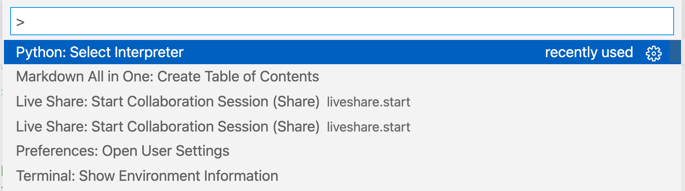

# DSI_Galvanize_May_17_2021 Notes for DSI Galvanize
**Markdown Preview Enhanced**
`Cmd+K, V` open preview side-by-side
**Markdown All in One**
`Command+Shift+P, Create t- [DSI_Galvanize_May_17_2021 Notes for DSI Galvanize](#dsi_galvanize_may_17_2021-notes-for-dsi-galvanize)- [DSI_Galvanize_May_17_2021 Notes for DSI Galvanize](#dsi_galvanize_may_17_2021-notes-for-dsi-galvanize)
- [DSI_Galvanize_May_17_2021 Notes for DSI Galvanize](#dsi_galvanize_may_17_2021-notes-for-dsi-galvanize)
- [Table of Contents](#table-of-contents)
  - [Relevant Links](#relevant-links)
- [Things that drive you NUTS !!!](#things-that-drive-you-nuts-)
  - [Environments](#environments)
    - [Activate my_environment:](#activate-my_environment)
    - [Check for installed modules:](#check-for-installed-modules)
  - [VS Code is using python 2.7 WTF ?!](#vs-code-is-using-python-27-wtf-)
  - [Jupyter import error of installed module](#jupyter-import-error-of-installed-module)
- [SQL](#sql)
- [Git](#git)
  - [Listing Python, rather than Jupyter in Languages](#listing-python-rather-than-jupyter-in-languages)
  - [.gitignore](#gitignore)
  - [Correcting .gitignore mistakes](#correcting-gitignore-mistakes)
  - [Huge files headache](#huge-files-headache)
  - [MacOS password requests](#macos-password-requests)
  - [Quick reference](#quick-reference)
- [Markdown](#markdown)
  - [Syntax, LaTex](#syntax-latex)
  - [Images](#images)
- [Bash Scripting](#bash-scripting)
    - [make a bash function](#make-a-bash-function)
  - [Terminal tricks](#terminal-tricks)
    - [recall line editing in terminal](#recall-line-editing-in-terminal)
- [Zoom](#zoom)
  - [!49 Participants](#)
- [Python](#python)
  - [Iterate through two lists](#iterate-through-two-lists)
  - [RAW string for path](#raw-string-for-path)
  - [Debugging print as a function of variable](#debugging-print-as-a-function-of-variable)
  - [Syntax](#syntax)
    - [Type Hints](#type-hints)
    - [Formatting and rounding limit number of digits](#formatting-and-rounding-limit-number-of-digits)
    - [Nested Loop with product](#nested-loop-with-product)
    - [Saving pictures](#saving-pictures)
  - [Data wrangling](#data-wrangling)
    - [Basic python loop](#basic-python-loop)
    - [Split](#split)
    - [Space separated numerical data](#space-separated-numerical-data)
  - [Jupyter Notebooks](#jupyter-notebooks)
    - [jup shortcut (credit: Hamid)](#jup-shortcut-credit-hamid)
    - [correct closure of notebooks](#correct-closure-of-notebooks)
  - [Comprehensions](#comprehensions)
  - [functions to remember](#functions-to-remember)
- [Numpy](#numpy)
  - [Number of digits to print](#number-of-digits-to-print)
- [Pandas](#pandas)
  - [Visualizations](#visualizations)
    - [Histograms of all columns](#histograms-of-all-columns)
    - [Cross-correlation plot](#cross-correlation-plot)
  - [Data checks](#data-checks)
  - [Data extraction](#data-extraction)
    - [Syntax matters brackets positions[]](#syntax-matters-brackets-positions)
    - [Multiindex mess and reset_index()](#multiindex-mess-and-reset_index)
  - [Machine Learning Workflow](#machine-learning-workflow)
    - [Cross Validation](#cross-validation)
    - [k-fold Cross Validation](#k-fold-cross-validation)
    - [Bootstrap](#bootstrap)
- [Sorting Algorithms](#sorting-algorithms)
  - [Bubble Sort](#bubble-sort)
- [`matplotlib.pyplot` visualizations](#matplotlibpyplot-visualizations)
  - [Show gray picture as gray](#show-gray-picture-as-gray)
  - [Color style](#color-style)
  - [Color cycler](#color-cycler)
  - [Subplots](#subplots)
  - [Single letter legend](#single-letter-legend)
  - [Font Sizes](#font-sizes)
- [Derivations](#derivations)
# Table of Contents
[DSI_Galvanize_May_17_2021 Notes for DSI Galvanize](#dsi_galvanize_may_17_2021-notes-for-dsi-galvanize)- [DSI_Galvanize_May_17_2021 Notes for DSI Galvanize](#dsi_galvanize_may_17_2021-notes-for-dsi-galvanize)
- [DSI_Galvanize_May_17_2021 Notes for DSI Galvanize](#dsi_galvanize_may_17_2021-notes-for-dsi-galvanize)
- [Table of Contents](#table-of-contents)
  - [Relevant Links](#relevant-links)
- [Things that drive you NUTS !!!](#things-that-drive-you-nuts-)
  - [Environments](#environments)
    - [Activate my_environment:](#activate-my_environment)
    - [Check for installed modules:](#check-for-installed-modules)
  - [VS Code is using python 2.7 WTF ?!](#vs-code-is-using-python-27-wtf-)
  - [Jupyter import error of installed module](#jupyter-import-error-of-installed-module)
- [SQL](#sql)
- [Git](#git)
  - [Listing Python, rather than Jupyter in Languages](#listing-python-rather-than-jupyter-in-languages)
  - [.gitignore](#gitignore)
  - [Correcting .gitignore mistakes](#correcting-gitignore-mistakes)
  - [Huge files headache](#huge-files-headache)
  - [MacOS password requests](#macos-password-requests)
  - [Quick reference](#quick-reference)
- [Markdown](#markdown)
  - [Syntax, LaTex](#syntax-latex)
  - [Images](#images)
- [Bash Scripting](#bash-scripting)
    - [make a bash function](#make-a-bash-function)
  - [Terminal tricks](#terminal-tricks)
    - [recall line editing in terminal](#recall-line-editing-in-terminal)
- [Zoom](#zoom)
  - [!49 Participants](#)
- [Python](#python)
  - [Iterate through two lists](#iterate-through-two-lists)
  - [RAW string for path](#raw-string-for-path)
  - [Debugging print as a function of variable](#debugging-print-as-a-function-of-variable)
  - [Syntax](#syntax)
    - [Type Hints](#type-hints)
    - [Formatting and rounding limit number of digits](#formatting-and-rounding-limit-number-of-digits)
    - [Nested Loop with product](#nested-loop-with-product)
    - [Saving pictures](#saving-pictures)
  - [Data wrangling](#data-wrangling)
    - [Basic python loop](#basic-python-loop)
    - [Split](#split)
    - [Space separated numerical data](#space-separated-numerical-data)
  - [Jupyter Notebooks](#jupyter-notebooks)
    - [jup shortcut (credit: Hamid)](#jup-shortcut-credit-hamid)
    - [correct closure of notebooks](#correct-closure-of-notebooks)
  - [Comprehensions](#comprehensions)
  - [functions to remember](#functions-to-remember)
- [Numpy](#numpy)
  - [Number of digits to print](#number-of-digits-to-print)
- [Pandas](#pandas)
  - [Visualizations](#visualizations)
    - [Histograms of all columns](#histograms-of-all-columns)
    - [Cross-correlation plot](#cross-correlation-plot)
  - [Data checks](#data-checks)
  - [Data extraction](#data-extraction)
    - [Syntax matters brackets positions[]](#syntax-matters-brackets-positions)
    - [Multiindex mess and reset_index()](#multiindex-mess-and-reset_index)
  - [Machine Learning Workflow](#machine-learning-workflow)
    - [Cross Validation](#cross-validation)
    - [k-fold Cross Validation](#k-fold-cross-validation)
    - [Bootstrap](#bootstrap)
- [Sorting Algorithms](#sorting-algorithms)
  - [Bubble Sort](#bubble-sort)
- [`matplotlib.pyplot` visualizations](#matplotlibpyplot-visualizations)
  - [Show gray picture as gray](#show-gray-picture-as-gray)
  - [Color style](#color-style)
  - [Color cycler](#color-cycler)
  - [Subplots](#subplots)
  - [Single letter legend](#single-letter-legend)
  - [Font Sizes](#font-sizes)
- [Derivations](#derivations)

## Relevant Links
* [Visualizing `scipy.stats` distributions](https://stackoverflow.com/questions/37559470/what-do-all-the-distributions-available-in-scipy-stats-look-like)
* [MathJax basic tutorial and quick reference](https://math.meta.stackexchange.com/questions/5020/mathjax-basic-tutorial-and-quick-reference)
example:
```
$\sum_{i=0}^n i^2 = \frac{(n^2+n)(2n+1)}{6}$
Does not render in GitHub !
```
$\sum_{i=0}^n i^2 = \frac{(n^2+n)(2n+1)}{6}$
* VirtualBoxVM on MacOS for Ubuntu installation instructions:
[Step-by-Step info for MacOS](https://siytek.com/ubuntu-mac-virtualbox/)

# Things that drive you NUTS !!!
## Environments
### Activate my_environment:
`conda activate my_environment`
### Check for installed modules:
`conda list`
## VS Code is using python 2.7 WTF ?!
Control+` opens terminal, you type `python -V, and ... drum roll ...
```
(base) alexey_imac@ALEXEYs-iMac src % python -V
Python 2.7.16
```
well you can activate your fancy-shmancy Machien Learning environment with TensorFlow 2 and shit, but ...
```
(base) alexey_imac@ALEXEYs-iMac src % conda activate tf2
(tf2) alexey_imac@ALEXEYs-iMac src % python -V
Python 2.7.16
(tf2) alexey_imac@ALEXEYs-iMac src %
```
WTF ?!
Well if you calm down and press Ctrl+Shift+P, if necessary type "Python: Select Interpreter", you will find out that unless specifically told to use one, VSCode just grabs the first thing to come along in the system path, in this case Python 2.7 !!!


Sure enough ! How is VSCode supposed to read you MIND ?! It ain't that smart ... YET
<font size="10">👽</font>
The sad part selection does not stick. Once selected, check for nother Ctrl+Shift+P shows

## Jupyter import error of installed module
Jupyter packages installation problem follow up:
Ref. https://github.com/jupyter/jupyter/issues/270
To refresh, bs4 (BeautifulSoup), and a number of other packages would not be recognized in jupyter despite being explicitly installed in anaconda. Turns out the problem was that Jupyter was loading the wrong kernel (how and why do not care). Diagnostics can be performed as follows:
(base) … % jupyter kernelspec list
Available kernels:
 python3  /Users/alexey_imac/Library/jupyter/kernels/python3
if one gets output similar to shown above, not the one shown below with anaconda3, DESTROY python3 directory shown above by
cd /Users/alexey_imac/Library/jupyter/kernels/python3
cd ..
rm -rf python3
CORRECT OUTPUT for (base) … % jupyter kernelspec list
python3  /Users/alexey_imac/opt/anaconda3/share/jupyter/kernels/python3
re-check again(jupyter kernelspec list), jupyter should now locate correct anaconda3 branch of python3.
Rer-launch jupyter notebook, and try to import modules that were not recognized before (In my case import bs4). Hopefully it would work now.
There should be more elegant ways to force jupyter use correct kernel, datails are to be updated.

# SQL
* ROUND to 1000
 ```
SELECT name, population AS "POP", ROUND(gnp, -3)
FROM country
WHERE continent = 'South America' AND gnp > 0
ORDER BY population ASC;
 ```
 * CASE WHEN
```
SELECT name,
       CASE WHEN continent='Caribbean' THEN 'North America'
            ELSE continent END
FROM country
WHERE name LIKE 'J%';
```

# Git
## Listing Python, rather than Jupyter in Languages
Pro tip: Go to your capstone repo and create a file called .gitattributes. The file should contain one line:
`*.ipynb linguist-language=Python`
This will cause GitHub to recognize your notebook coding language as Python instead of listing your repo's primary language as Jupyter Notebooks.
Credit: [Andrew Nicholls](https://www.linkedin.com/in/andrewsnicholls/) June 17, 2021
## .gitignore
Gotta have it locally, and here is the format to ignore *.jpg files in subdirectories of the directory img:
`/img/**/*.jpg` [Credit](https://stackoverflow.com/questions/6794717/git-ignore-certain-files-in-sub-directories-but-not-all)
This pattern works for me for data subfolder ignoring only png and jpg files:
`**/data/**/*.png`
`**/data/**/*.jpg`
## Correcting .gitignore mistakes
Check the list of files currently being tracked:
`git ls-tree --name-only HEAD`
if files ARE listed, but should not, remove files(make a copy someplace), got through git add, commit, push to get a clean status, make sure .gitignore syntax is correct, put files back in, run git status to make sure files are not being added (.gitignore is working), proceed from there.
If on the other hand you just used `git add .` and are not sure `.gitignore` is working correctly, perform a quick check by `git status`, and if unwanted files were added, remove 'em from cached by `git rm -r --cached KERAS_data/**` where all files in `KERAS_data` are to be ignored. Confirm removal by running `git status`. In this case correct `.gitignore` syntax is `KERAS_data/` to ignore all files in all subdirectories of `KERAS_data`.

## Huge files headache
[Ref.1 stackoverflow.com](https://stackoverflow.com/questions/33360043/git-error-need-to-remove-large-file)
```
$ git rm --cached giant_file
# Stage our giant file for removal, but leave it on disk

git commit --amend -CHEAD
# Amend the previous commit with your change
# Simply making a new commit won't work, as you need
# to remove the file from the unpushed history as well

git push
# Push our rewritten, smaller commit
```
* If several commits behind, find how many by `git status`. Say you are 4 (four) commits behind, since you tried to push with errors, and kept `git add .` and then `git push` with errors resulting in 4(four) unsuccessful commits. Type `git reset --soft HEAD~4`, where `~4` is the number of failed commits.
If everything else fails, make a copy of your current directory, do `git reset --hard HEAD`, `git pull`, update `.gitignore` or `exclude` to remove huge data file from git, move new/changed files from a copy directory, and try to do it all over again - `git add .`, `git commit -m "Meaningful message"`, and finally `git push` while keeping your fingers crossed.

[Ref.2 docs.github.com](https://docs.github.com/en/github/getting-started-with-github/getting-started-with-git/ignoring-files#excluding-local-files-without-creating-a-gitignore-file)
* [Excluding local files without creating a .gitignore file](https://docs.github.com/en/github/getting-started-with-github/getting-started-with-git/ignoring-files#excluding-local-files-without-creating-a-gitignore-file)
  `.git/info/exclude`
  *[Configuring ignored files for a single repository](https://docs.github.com/en/github/getting-started-with-github/getting-started-with-git/ignoring-files#configuring-ignored-files-for-a-single-repository)
  `touch .gitignore`
## MacOS password requests
* Git keeps prompting me for user name and password every time
[credit](https://stackoverflow.com/questions/7773181/git-keeps-prompting-me-for-a-password)
Configuring credential.helper: On OS X (now macOS), run this in Terminal:
`git config --global credential.helper osxkeychain`
When pushing/pulling for the first time after that, reply always in keychain popup window
## Quick reference
* create new repository on githup, copy address and run in local directory git pull "GitHub URL"
* mess with data locally, then in local terminal run the following:
* git status
* git add .
* git status
* git commit -m ""Here is what was done""
* git push
* To navigate back to TOC above, `Ctrl+Up`


# Markdown
## Syntax, LaTex
* new line `<br />` [credit](https://stackoverflow.com/questions/24575680/new-lines-inside-paragraph-in-readme-md)
* Greek letters `$\tau$` $\tau$, `$\theta$` $\theta$ [credit](https://stackoverflow.com/questions/54698075/how-do-i-print-greek-letters-in-jupyter)
* Font size `\Huge, \huge, \Large, \large` [credit](https://texblog.org/2012/08/29/changing-the-font-size-in-latex/)
* `$\frac{n!}{k!(n-k)!}$` $\frac{n!}{k!(n-k)!}$ [credit](https://csrgxtu.github.io/2015/03/20/Writing-Mathematic-Fomulars-in-Markdown/)
* $\Huge \frac{n!}{k!(n-k)!}$ `\Huge`

* Ctrl+K,V open preview to the right
[Marketplace URL](https://marketplace.visualstudio.com/items?itemName=shd101wyy.markdown-preview-enhanced)


* [Python section of this doc](#python) (Internal Links/anchors to sections)
## Images
```

```


------------------------------
# Bash Scripting
* bash profile location on OSX: '~/.bash_profile'
* gitadder command not found - in addition to adding gitadder to '~/.bash_profile', refer '~/.zshrc', not '~/.zsh' edit, and reboot:
```bash
# May 4, 2021
# /Users/alexey_imac/.bash_profile = ~/.bash_profile
export PATH="/Users/alexey_imac:$PATH"
# https://stackoverflow.com/questions/18428374/commands-not-found-on-zsh
# Created by code ~/.zsh
# Added hoping to get gitadder function in  ~/.bash_profile to work
# instead of getting
# zsh: command not found: gitadder
source ~/.bash_profile
```
### make a bash function
triple tics ` create a code block, and bash declares language to color code
```bash
function gitadder(){
    git pull  # pull possible updates from GitHub
    git add .  # Add everything - dangerous ?
    # dt=$(date '+%d/%m/%Y %H:%M:%S');
    git commit -m "Auto Updated: $(date '+%a
    %M:%H %h %d %Y')"  # date is shell comand
    git push
}
```
* recursive delete a directory: `rm -rf <directory_name>`
## Terminal tricks
[Credit](https://lifehacker.com/ctrl-r-to-search-and-other-terminal-history-tricks-278888)
* `Tab` completion
* `history` - display command history
* `Up / Down` keys - most recent comman recall
* `^Control + R` (iMac) search as you type, when found Enter
* `!characters` - last command
* Increase retained history - .bash_profile, or .zshrc (refer `man bash` "HISTORY")
```q
HISTFILESIZE=1000000000
HISTSIZE=1000000
```
* review terminal stats [here](https://lifehacker.com/review-your-most-oft-used-unix-commands-202712)
* `Esc-backspace` delete previous word
* `Escape-d` delete forward word
* `Ctrl+U` delete backward to beginning (can be found in `man bash` "Killing and Yanking")
* well we are actually using `zsh`
### recall line editing in terminal
after up arrow or typing beginning, and Esc+p or Ctrl+R recall,
* `Ctrl+c` **Give up** on the current line, return to prompt
* `Ctrl+a` place cursor at the **start of the line**
* `Ctrl+e` place cursor at the **end of the line**
* `ESC+f` _move forward_ to the beginning of the next word (make sure to release Esc after each jump, and press again)
* `ESC+b` _move left_ back one word
* `Esc+d` **delete word** current word (cursor is at the first character of the word)
* `Ctrl+k` **delete right** all characters to the right of cursor, including current word
* `Ctrl+w` **delete left** left (cursor at the first character of the word to keep)  characters to the left of cursor
* `Esc-p` or `Ctrl+r` **history** having typed a few characters, search for similar start
* `Command+K` = `clear` **clear** screen from previous outputs in MacOS
* `.zsh_history / .bash_history` stores commands
* `.zshrc` or `.bashrc`
** Adding functionality to show your current github branch (if in a github repo)
** Colors/appearance/themes
** Spellcheck
** Package/Language specific functionality
** Different/enhanced autocomplete settings
# Zoom
[Video Freeze](https://www.youtube.com/watch?v=FozorSuK2Sc)
* Preferences->Video->Advanced->Uncheck hardware acceleration box
* Blured background - on Mac - available in 5.5.0 and up, check version: 


---------------------------------
# Python
## Iterate through two lists
`for i,j in zip(list1, list2):`
## RAW string for path
`src = r'C:\Users\Administrator.SHAREPOINTSKY\Desktop\Work\name.txt'`
[Credit](https://stackoverflow.com/questions/41155382/add-r-prefix-to-a-python-variable)

## Debugging print as a function of variable
[Credit](https://stackoverflow.com/questions/6579496/using-print-statements-only-to-debug)
```DEBUG = True

def log(s):
    if DEBUG:
        print s

log("hello world")
```
Then you can change the value of DEBUG and run your code with or without logging.

The standard logging module has a more elaborate mechanism for this.

## Syntax
### Type Hints
* typing — Support for type hints [credit](https://docs.python.org/3/library/typing.html)
`def greeting(name: str) -> str:` <br />
`    return 'Hello ' + name`
### Formatting and rounding limit number of digits
* formatting
```
print("Sample Mean: {0:1.3f}".format(mu_hat))
Sample Mean: -0.159
```
```
numvar = 135.12345678910
str(round(numvar, 1))
'135.1'
```
### Nested Loop with product
* for mu, sigma_sq in product([-1, 0, 1], [0.5, 1, 2]):
```
from itertools import product

for mu, sigma_sq in product([-1, 0, 1], [0.5, 1, 2]):
    print("Log-Lik of Two Parameter Normal Model With mu={0}, sigma_sq={1}: {2:3.2f}".format(
        mu, sigma_sq, log_likelihood_normal_two_parameters(mu, sigma_sq, data))
    )

Log-Lik of Two Parameter Normal Model With mu=-1, sigma_sq=0.5: -102.05
Log-Lik of Two Parameter Normal Model With mu=-1, sigma_sq=1: -82.66
Log-Lik of Two Parameter Normal Model With mu=-1, sigma_sq=2: -81.63
Log-Lik of Two Parameter Normal Model With mu=0, sigma_sq=0.5: -52.85
Log-Lik of Two Parameter Normal Model With mu=0, sigma_sq=1: -58.06
Log-Lik of Two Parameter Normal Model With mu=0, sigma_sq=2: -69.33
Log-Lik of Two Parameter Normal Model With mu=1, sigma_sq=0.5: -103.64
Log-Lik of Two Parameter Normal Model With mu=1, sigma_sq=1: -83.46
Log-Lik of Two Parameter Normal Model With mu=1, sigma_sq=2: -82.03

```
### Saving pictures
`plt.savefig('../images/hist_plot1.png')`


## Data wrangling
### Basic python loop
```
def two_lst_intersec(lst1=[], lst2=[]):
    '''
    Return intersection of arr1 and arr2, unique elements only

    '''
    lst3 = [] # initialize intersection

    for i in lst1: # loop through 1st array
        if (i in lst2 and i not in lst3):
            lst3.append(i)


    return lst3
```
### Split
* Create list from a string, or split string:
```
emails = "ase@gmail.com, am@comcast.net, cbd@gmail.com, are@hotmail.com, yahoo@hotmail.com, col@yahoo.com,\
            inte@comcast.net, gmail.info@gmail.com, por@hotmail.com, crt@comcast.net, gbm@sbcglobal.net, arc@gmail.com,\
            mail@gmail.com, ant@hotmail.com, mod@yahoo.com, fli@comcast.net, qrc.net@gmail.com, mail@yahoo.com,\
            ure@comcast.net, com@gmail.com, re@comcast.net, email@qq.net, info@yahoo.com, text.com@sbcglobal.net"
def email_domains_dict(email_str: str):
    '''
    Split email string into a dictionary of
    {'@gmail.com': [ase, am, person5], '@msn.com': [Jon5]} etc.
    '''
    # Split string into a list
    tmp = emails.split(sep=",") # split string in a list ['email1', 'email2', etc.]

    # Initiate collection dictionary
    emails_dict = {}

    for i in tmp:
        [alias, domain] = i.split(sep='@')

        if domain in emails_dict: # append alias to values
            emails_dict[domain].append(alias)
        else:  # new domain found
            emails_dict[domain] = [alias] # create new key, AND populate with a list with an alias

    # strip spaces


    return emails_dict
```
### Space separated numerical data
[credit](https://stackoverflow.com/questions/19555472/change-a-string-of-integers-separated-by-spaces-to-a-list-of-int)
Say you are supposed to use data that looks like print output like this:
data = [-0.24525234  0.34258838  0.66512235 -2.15445321  1.30069225  0.42041963
 -0.67904514  0.2990795  -0.20201848  0.05410431  0.26106412 -0.89171509
 -0.15872403  0.83111975 -0.11941908  0.00667906  0.10079108 -0.60899067
  0.52596165  0.08029374  0.80668211 -0.10465914 -0.44508377 -0.76350006
  0.55267201  0.53581223 -0.68529436 -0.64163356  0.4809197  -0.97424692
 -0.12309056  0.30210824 -0.50851312  0.49089701 -0.5729919   1.84253363
 -0.77796115  0.49132436 -0.50516287 -0.09554953  0.70306746  0.17312964
  1.37490091 -0.72273023 -0.68162468  0.01836007  0.71899727 -0.86227295
 -0.04175399 -0.21037323]
 Not very useful, do this:
 * Chage text to a string (add line continuation `\` at each line), replace closing `]` with `"` at the last line to create a long string
 * rename to data_s
 * split, and convert to a numerical list using list comprehension:
 data_s = "-0.24525234  0.34258838  0.66512235 -2.15445321  1.30069225  0.42041963 \
 -0.67904514  0.2990795  -0.20201848  0.05410431  0.26106412 -0.89171509 \
 -0.15872403  0.83111975 -0.11941908  0.00667906  0.10079108 -0.60899067 \
  0.52596165  0.08029374  0.80668211 -0.10465914 -0.44508377 -0.76350006 \
  0.55267201  0.53581223 -0.68529436 -0.64163356  0.4809197  -0.97424692 \
 -0.12309056  0.30210824 -0.50851312  0.49089701 -0.5729919   1.84253363 \
 -0.77796115  0.49132436 -0.50516287 -0.09554953  0.70306746  0.17312964 \
  1.37490091 -0.72273023 -0.68162468  0.01836007  0.71899727 -0.86227295 \
 -0.04175399 -0.21037323"
data = [float(i) for i in data_s.split()]
print(data)
* to get this:
* [-0.24525234, 0.34258838, 0.66512235, -2.15445321, 1.30069225, 0.42041963, -0.67904514, 0.2990795, -0.20201848, 0.05410431, 0.26106412, -0.89171509, -0.15872403, 0.83111975, -0.11941908, 0.00667906, 0.10079108, -0.60899067, 0.52596165, 0.08029374, 0.80668211, -0.10465914, -0.44508377, -0.76350006, 0.55267201, 0.53581223, -0.68529436, -0.64163356, 0.4809197, -0.97424692, -0.12309056, 0.30210824, -0.50851312, 0.49089701, -0.5729919, 1.84253363, -0.77796115, 0.49132436, -0.50516287, -0.09554953, 0.70306746, 0.17312964, 1.37490091, -0.72273023, -0.68162468, 0.01836007, 0.71899727, -0.86227295, -0.04175399, -0.21037323]
## Jupyter Notebooks
### jup shortcut (credit: Hamid)
In ~/.zshrc add:
```
# Galvanize Unix lecture aliases
# for those tired of typing jupiter notebook:
alias jup="jupyter notebook"
# to update edits: source ~/.zshrc
```
### correct closure of notebooks
1. Logout notebook, close tab
2. Logout jupyter file browser, close tab
3. in corresponding terminal where jupyter was launched from Ctrl+C, Yes to close jupyter server
4. Make sure there are no hung up jupyter severs: `jupyter notebook list`
5. If none are listed, in terminal `exit, Ctrl+q` to close terminal - clean close

## Comprehensions
```python
[num for num in range(100)]
```

## functions to remember
```python
def factorial(n):
    prod = 1
    for num in range(n+1):
        prod*= num
    return prod
```

# Numpy
## Number of digits to print
[Source](https://numpy.org/doc/stable/reference/generated/numpy.set_printoptions.html)
`np.set_printoptions(precision=4)`

# Pandas
* May 20, 2021 Comment was made during pandas lecture (Andrew Nicholls) - pandas load data in memory, and are therefore fast, BUT it becomes a liability for large datasets.
Q: Is there a way to estimate size of data before loading to prevent crash?
A Credit (Everett Schroeder):
[Loading large datasets in Pandas](https://towardsdatascience.com/loading-large-datasets-in-pandas-11bdddd36f7b)

## Visualizations
### Histograms of all columns
```
df.hist(figsize=(15,15))
plt.savefig(‘df_hist.pdf’, dpi=300)
```
### Cross-correlation plot
`pd.plotting.scatter_matrix(df, figsize=(10,10)`


## Data checks
* Show non NaNs in a column
`df['Verified Date'].dropna().head`
* Multi_index
```
payments_this_month.loc[payments_this_month.index.get_level_values(1).isin(active_loan_ids), :]

all_payments.loc[pd.IndexSlice[:, loan_ids_from_training_set], :][cols]
```
## Data extraction
### Syntax matters brackets positions[]
* This does not work:
`df_tmp[df_tmp['Species' == 'Coho']]`
* This does:
`df_tmp['Species'] == 'Coho'`
In general try to separate filter creation in a separate line for code transparency sake. This works:

```
df_tmp[df_tmp['Species'] == 'Coho']
```
This reads better:
```
filter_bool = df_tmp['Species'] == 'Coho'
df_tmp[filter_bool]
```
### Multiindex mess and reset_index()
```
In [26]: df2c
Out[26]:
Return Year  Species
1976         Chinook      14482
             Chum             5
             Coho         21934
1977         Chinook       9913
             Chum             4
                          ...
2020         Coho         14245
             Steelhead       12
             Unknown          4
2021         Chinook         33
             Steelhead        1
Length: 211, dtype: int64
# ======
In [27]: df2c.reset_index()
Out[27]:
     Return Year    Species      0
0           1976    Chinook  14482
1           1976       Chum      5
2           1976       Coho  21934
3           1977    Chinook   9913
4           1977       Chum      4
..           ...        ...    ...
206         2020       Coho  14245
207         2020  Steelhead     12
208         2020    Unknown      4
209         2021    Chinook     33
210         2021  Steelhead      1

[211 rows x 3 columns]
# ==========
In [30]: df_tmp = df2c.reset_index()

In [31]: df_tmp[df_tmp['Species'] == 'Coho']
Out[31]:
     Return Year Species       0
2           1976    Coho   21934
5           1977    Coho   25826
9           1978    Coho   20836
13          1979    Coho   25235
18          1980    Coho   39638
...
202         2019    Coho   43973
206         2020    Coho   14245
```
---------------------------

## Machine Learning Workflow

### Cross Validation
```python
# train/test split

```

### k-fold Cross Validation

### Bootstrap

------------------
# Sorting Algorithms

## Bubble Sort

```python
# hand coded algorythm
```

```python
# library call
```
# `matplotlib.pyplot` visualizations
## Show gray picture as gray
```
fig, ax = plt.subplots(1, 2, figsize=(15, 10))
ax[0].imshow(img_np)
ax[1].imshow(img_np_gr, cmap='gray')
```

## Color style
[Ref.](https://matplotlib.org/stable/gallery/style_sheets/ggplot.html)
`plt.style.use('ggplot')`
## Color cycler
[Ref.](https://stackoverflow.com/questions/53521396/how-to-implement-automatic-color-change-in-matplotlib-with-subplots)
```
colors = plt.rcParams["axes.prop_cycle"]()
...
# Get the next color from the cycler
c = next(colors)["color"]
...
ax.plot(x, y, label=label, color=c)
```
## Subplots
[subplots](https://matplotlib.org/stable/api/_as_gen/matplotlib.pyplot.subplots.html)
```
line_width = 3
fig, ax = plt.subplots(figsize=(10, 5))
ax.plot(x, y, label='My_Label', linewidth=line_width)
plt.legend(loc='upper left')
plt.title(f'Training and Validation Accuracy for {img_height}x{img_width} images')
plt.ylabel('y_label')
plt.xlabel('x_label')
plt.grid()
plt.tight_layout()
plt.show()


```
## Single letter legend
[Ref1](https://stackoverflow.com/questions/10557614/matplotlib-figlegend-only-printing-first-letter)
[Ref2](https://stackoverflow.com/questions/44632571/pyplot-legend-only-displaying-one-letter)
[Ref3]()
For the names of the legend, you have to surround it in square brackets
## Font Sizes
[credit](https://www.statology.org/change-font-size-matplotlib/)
* How to Change Font Sizes on a Matplotlib Plot
```
import matplotlib.pyplot as plt
font_size = 20
plt.rc('font', size=font_size) #controls default text size
plt.rc('axes', titlesize=font_size) #fontsize of the title
plt.rc('axes', labelsize=font_size) #fontsize of the x and y labels
plt.rc('xtick', labelsize=font_size) #fontsize of the x tick labels
plt.rc('ytick', labelsize=font_size) #fontsize of the y tick labels
plt.rc('legend', fontsize=font_size) #fontsize of the legend
```
-----------------
# Derivations
* [Derivation of Perceptron with LaTEX](https://github.com/ans12256/DSI_Galvanize_May_17_2021/blob/15b601cbd579136a87e1cef08c78a4b8000583aa/notebooks/derivation_of_a_perceptron.ipynb)
