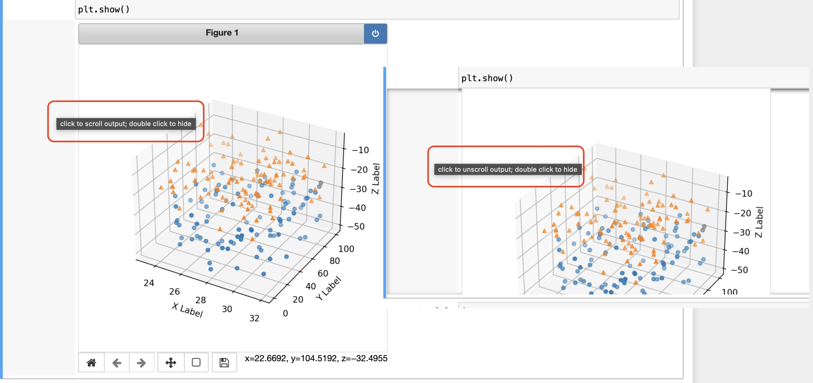

DSI_Galvanize_May_17_2021 Notes for DSI Galvanize
**Markdown Preview Enhanced**
`Cmd+K, V` open preview side-by-side
**Markdown All in One**
`Command+Shift+P, "Markdown All in One: Create Table of Contents ... (initiate with cursor UNDER # Table of Contents" to avoid creating TWO (2) tables`
# Table of Contents
- [Table of Contents](#table-of-contents)
  - [Relevant Links](#relevant-links)
- [Generic MacOS](#generic-macos)
  - [Passwords](#passwords)
    - [Generate random passwords if Safari does not want to](#generate-random-passwords-if-safari-does-not-want-to)
- [Things that drive you NUTS !!!](#things-that-drive-you-nuts-)
  - [Safari](#safari)
    - [Safari Print Selection](#safari-print-selection)
    - [Google Docs paste without format](#google-docs-paste-without-format)
  - [Environments](#environments)
    - [Activate my\_environment:](#activate-my_environment)
    - [Check for installed modules:](#check-for-installed-modules)
  - [500: Internal Server Error](#500-internal-server-error)
  - [conda update anaconda error](#conda-update-anaconda-error)
  - [VS Code is using python 2.7 WTF ?!](#vs-code-is-using-python-27-wtf-)
  - [Jupyter Notebook not saving: '\_xsrf' argument missing from post](#jupyter-notebook-not-saving-_xsrf-argument-missing-from-post)
  - [Jupyter import error of installed module](#jupyter-import-error-of-installed-module)
- [Abbreviations](#abbreviations)
  - [i.i.d.](#iid)
- [Full-Stack](#full-stack)
  - [Django](#django)
  - [Wagtail](#wagtail)
    - [kill localhost:8000 server](#kill-localhost8000-server)
    - ["Normal steps"](#normal-steps)
- [VSC Visual Studio Code](#vsc-visual-studio-code)
  - [Two (2) Workspaces/projects in one window](#two-2-workspacesprojects-in-one-window)
- [STATISTICS](#statistics)
- [SQL](#sql)
  - [SQL Normalization 1NF, 2NF etc.](#sql-normalization-1nf-2nf-etc)
  - [postgres](#postgres)
    - [Create database at specific location](#create-database-at-specific-location)
    - [ERROR:  invalid byte sequence for encoding "UTF8": 0xff](#error--invalid-byte-sequence-for-encoding-utf8-0xff)
    - [Run sql file from inside psql \\i '...'](#run-sql-file-from-inside-psql-i-)
    - [Basic Operations](#basic-operations)
    - [Most common commands](#most-common-commands)
    - [Extended display](#extended-display)
    - [Examples](#examples)
  - [WHERE ... IN (...)](#where--in-)
  - [WHERE ... LIKE '%string%'](#where--like-string)
  - [WHERE vs HAVING](#where-vs-having)
  - [UNION](#union)
  - [ROUND to 1000](#round-to-1000)
  - [CASE WHEN](#case-when)
- [Git](#git)
  - [How to save Jupyter notebooks from GitHub](#how-to-save-jupyter-notebooks-from-github)
  - [Code on Git in the browser the magic "." ?!](#code-on-git-in-the-browser-the-magic--)
  - [Remote URL](#remote-url)
  - [Merge conflicts](#merge-conflicts)
  - [Local links to files in repository](#local-links-to-files-in-repository)
  - [Listing Python, rather than Jupyter in Languages](#listing-python-rather-than-jupyter-in-languages)
  - [.gitignore](#gitignore)
  - [Correcting .gitignore mistakes](#correcting-gitignore-mistakes)
  - [Huge files headache](#huge-files-headache)
  - [MacOS password requests](#macos-password-requests)
  - [Quick reference](#quick-reference)
- [Markdown](#markdown)
  - [Syntax, LaTex](#syntax-latex)
  - [Images](#images)
- [Bash Scripting](#bash-scripting)
    - [help for zsh (Esc-h), man](#help-for-zsh-esc-h-man)
    - [make a bash function](#make-a-bash-function)
  - [Terminal tricks](#terminal-tricks)
    - [recall line editing in terminal](#recall-line-editing-in-terminal)
- [Zoom](#zoom)
  - [](#)
- [Jupyter](#jupyter)
  - [Magic Commands](#magic-commands)
- [Python](#python)
  - [print tricks no new line etc.](#print-tricks-no-new-line-etc)
    - [Escape apostrophe](#escape-apostrophe)
    - [No new line, separator](#no-new-line-separator)
    - [formatting output](#formatting-output)
  - [what is in session memory dir() ?](#what-is-in-session-memory-dir-)
  - [built-in functions, keywords and available functions](#built-in-functions-keywords-and-available-functions)
  - [pointing to the same memory check id(x)](#pointing-to-the-same-memory-check-idx)
  - [printing zip()](#printing-zip)
  - [$1,000,000 not quite 1\_000\_000](#1000000-not-quite-1_000_000)
  - [Sound (ref. yoga classifier)](#sound-ref-yoga-classifier)
  - [Timing code in python](#timing-code-in-python)
  - [Timing code in Jupyter](#timing-code-in-jupyter)
  - [Iterate through two lists](#iterate-through-two-lists)
  - [RAW string for path](#raw-string-for-path)
  - [Debugging print as a function of variable](#debugging-print-as-a-function-of-variable)
  - [Syntax](#syntax)
    - [Type Hints](#type-hints)
    - [Formatting and rounding limit number of digits](#formatting-and-rounding-limit-number-of-digits)
    - [Nested Loop with product](#nested-loop-with-product)
    - [Saving pictures](#saving-pictures)
  - [Data wrangling](#data-wrangling)
    - [Basic python loop](#basic-python-loop)
    - [Split](#split)
    - [Space separated numerical data](#space-separated-numerical-data)
  - [Jupyter Notebooks](#jupyter-notebooks)
    - [Changing Browser, say from Safari to FireFox](#changing-browser-say-from-safari-to-firefox)
    - [jul shortcut](#jul-shortcut)
    - [jup shortcut (credit: Hamid)](#jup-shortcut-credit-hamid)
    - [correct closure of notebooks](#correct-closure-of-notebooks)
  - [Comprehensions](#comprehensions)
  - [functions to remember](#functions-to-remember)
- [Numpy](#numpy)
  - [Number of digits to print](#number-of-digits-to-print)
  - [Useful functions](#useful-functions)
    - [.ravel() flatten the array](#ravel-flatten-the-array)
    - [numpy.c\_](#numpyc_)
- [geopy address/zip -\> gps converter](#geopy-addresszip---gps-converter)
- [geopandas GPS plots](#geopandas-gps-plots)
- [Pandas](#pandas)
  - [Create Data Frame with specific schema](#create-data-frame-with-specific-schema)
  - [Visualizations](#visualizations)
    - [Histograms of all columns](#histograms-of-all-columns)
    - [Cross-correlation plot](#cross-correlation-plot)
  - [Data checks](#data-checks)
    - [Show non NaNs in a column](#show-non-nans-in-a-column)
    - [Select object columns](#select-object-columns)
  - [Data extraction](#data-extraction)
    - [Basic slicing](#basic-slicing)
      - [Indexing:](#indexing)
    - [SettingWithCopyWarning:](#settingwithcopywarning)
    - [Complex conditions](#complex-conditions)
    - [Read json series](#read-json-series)
    - [Syntax matters brackets positions\[\]](#syntax-matters-brackets-positions)
    - [Multiindex mess and reset\_index()](#multiindex-mess-and-reset_index)
  - [Data Manipulation](#data-manipulation)
    - [Create new column based on dictionary](#create-new-column-based-on-dictionary)
    - [Convert string to](#convert-string-to)
    - [df.set\_index()](#dfset_index)
    - [df.apply / df.transform](#dfapply--dftransform)
- [Machine Learning](#machine-learning)
  - [References](#references)
  - [Saving Models](#saving-models)
  - [Confusion Matrix, Accuracy, Precision, Recall, F1 score](#confusion-matrix-accuracy-precision-recall-f1-score)
    - [Confusion Matrix](#confusion-matrix)
  - [SVM Support Vector Machines](#svm-support-vector-machines)
    - [Feature Scaling](#feature-scaling)
    - [Soft Margin Classification](#soft-margin-classification)
    - [Noninear SVM Classification](#noninear-svm-classification)
    - [Cross Validation](#cross-validation)
    - [k-fold Cross Validation](#k-fold-cross-validation)
    - [Outlier Detection](#outlier-detection)
    - [Kernel Trick](#kernel-trick)
  - [Regularized Linear Models Ridge, Lasso, and Elastic Net](#regularized-linear-models-ridge-lasso-and-elastic-net)
    - [Ridge](#ridge)
    - [Lasso](#lasso)
    - [Elastic Net](#elastic-net)
    - [Bootstrap](#bootstrap)
- [Sorting Algorithms](#sorting-algorithms)
  - [Bubble Sort](#bubble-sort)
- [`matplotlib.pyplot` visualizations](#matplotlibpyplot-visualizations)
  - [Mouse rotation and zoom of 3D plot](#mouse-rotation-and-zoom-of-3d-plot)
  - [How to prevent (scrollable) sub-window in Jupyter notebooks?](#how-to-prevent-scrollable-sub-window-in-jupyter-notebooks)
  - [Show gray picture as gray](#show-gray-picture-as-gray)
  - [Named colors](#named-colors)
  - [Color style](#color-style)
  - [Color cycler](#color-cycler)
  - [Subplots](#subplots)
  - [Single letter legend](#single-letter-legend)
  - [Font Sizes](#font-sizes)
- [Derivations](#derivations)

## Relevant Links
* [Visualizing `scipy.stats` distributions](https://stackoverflow.com/questions/37559470/what-do-all-the-distributions-available-in-scipy-stats-look-like)
* [MathJax basic tutorial and quick reference](https://math.meta.stackexchange.com/questions/5020/mathjax-basic-tutorial-and-quick-reference)
example:
```
$\sum_{i=0}^n i^2 = \frac{(n^2+n)(2n+1)}{6}$
Does not render in GitHub !
```
$\sum_{i=0}^n i^2 = \frac{(n^2+n)(2n+1)}{6}$
* VirtualBoxVM on MacOS for Ubuntu installation instructions:
[Step-by-Step info for MacOS](https://siytek.com/ubuntu-mac-virtualbox/)

# Generic MacOS
## Passwords
### Generate random passwords if Safari does not want to
[YouTube MacMostVideo Credit](https://youtu.be/v37C6KJmDGE)
* Keychain - "New Password Item" Ctrl+N, click a small key icon to open a "Password Assistant" window, select type and length with the strength feedback
* **Terminal #1** - `% date | md5` creates a checksum from date output that looks something like `Wed Apr 19 11:45:01 PDT 2023` "piped" via "|" into something like `61fc3f1aa0105adca93129b4e3fc4dc0`. Use the whole output or a portion of it as a new assword. <br /> _man md5_ or _man date_ would provide more details about commands used.
* **Terminal #2** - `% openssl rand -base64 6` could output something like `2G9x7rqj`. Replacing last number in the command shown above with say 16 (instead of 6) could generate a longer output that could look like `k7OcXeAbL/ll31xcA+IBqw==`
* **Terminal #3** - `% cat /dev/urandom | LC_ALL=C tr -dc 'a-zA-Z0-9-_\$' | fold -w 8 | sed 1q` could output something like `PBPvKFV8`. In command string above, `8` is the length of the password, `\$` is used to specify dollar sign as one of the characters to possibly used in the password (not sure why `\` in front of the `$` is required, but apparently it is), as well as dash and underscore `-_`.
* Use of `Automator` to create an `Action` for commands shown above is possible, but is it really necessary?
# Things that drive you NUTS !!!
## Safari
### Safari Print Selection
[Credit](https://forums.macrumors.com/threads/how-do-i-print-selection-only-safari.79715/)
Select area on the page, and press `Command+Shift+Y` `⌘⇧Y` this creates a "Sticky Note" and opens corresponding Apple app (Yes there is a Stickies app on MacOS! 😅), then just `Command+P` to open print preview, and maybe `Command+Q` to close Stickies app.
### Google Docs paste without format
Credit: [Colin Parker](https://www.linkedin.com/in/colinmp/)
`Shift+Option+Command+V` `⇧⌥⌘V`. The reward for the contorted fingers is a nice plain format paste operation !
## Environments
### Activate my_environment:
`conda activate my_environment`
### Check for installed modules:
`conda list geo` where `geo` is a substring of the package name. Otherwise the whole list is output. Essentially, conda list accepts regex.
from Jupyterlab
`!pip list`
## 500: Internal Server Error
Attempts to install geopandas in (base) environment had been disastrous (Dec. 15, 2021) leading to multiple attempts to restore functionality as
`conda list --revisions` with subsequent attempts to `conda install --revision 27`, where `27` was configuration prior to geopandas mess. These attempts were ultimately unsuccessful with a list of packages being diagnosed as missing, and attempts to reinstall them unsuccessful.
Eventually two steps allowed to restore functionality:
* STEP 1 [Clean anaconda install](https://stackoverflow.com/questions/62359771/warning-2-possible-package-resolutions-only-showing-differing-packages-anaconda):
```
conda install anaconda-clean
anaconda-clean --yes
conda update --all
```
* STEP 2 [Re-install jupyter](https://anaconda.org/anaconda/jupyter)
`conda install -c anaconda jupyter`
* STEP 3
`conda uninstall geopandas`
Remove geopandas, that while being listed in `conda list geo`, would not import in a notebook complaining about unavailability of C library or something to this effect.
* Surprisingly uninstallation of geopandas resulted in a huge list of various packages being updated/superseded/removed
* STEP 4
[install geopandas in geo_env](https://geopandas.org/en/stable/getting_started/install.html)
```
conda create -n geo_env
conda activate geo_env
conda config --env --add channels conda-forge
conda config --env --set channel_priority strict
conda install python=3 geopandas
```
Well it turned out it was not the end of the story. Jupyter would launch fine in geo_env, but the kernel would not be visible ?!
```
(geo_env) alexey_imac@ALEXEYs-iMac TEMP % jupyter kernelspec list
[ListKernelSpecs] WARNING | Native kernel (python3) is not available
[ListKernelSpecs] WARNING | Native kernel (python3) is not available
No kernels available
```
Additional search located [this entry](https://stackoverflow.com/questions/58068818/how-to-use-jupyter-notebooks-in-a-conda-environment/58068850#58068850) with the following commands fixing the issue:
```
conda install ipykernel
ipython kernel install --user --name=geo_env
(geo_env) alexey_imac@ALEXEYs-iMac TEMP % jupyter kernelspec list
Available kernels:
  geo_env    /Users/alexey_imac/Library/Jupyter/kernels/geo_env
  python3    /Users/alexey_imac/opt/anaconda3/envs/geo_env/share/jupyter/kernels/python3
```
## conda update anaconda error
[PackageNotInstalledError: Package is not installed in prefix](https://stackoverflow.com/questions/51712693/packagenotinstallederror-package-is-not-installed-in-prefix)
```
conda update --name base conda
conda list --name base conda
conda update --all
```
## VS Code is using python 2.7 WTF ?!
Control+` opens terminal, you type `python -V, and ... drum roll ...
```
(base) alexey_imac@ALEXEYs-iMac src % python -V
Python 2.7.16
```
well you can activate your fancy-shmancy Machien Learning environment with TensorFlow 2 and shit, but ...
```
(base) alexey_imac@ALEXEYs-iMac src % conda activate tf2
(tf2) alexey_imac@ALEXEYs-iMac src % python -V
Python 2.7.16
(tf2) alexey_imac@ALEXEYs-iMac src %
```
WTF ?!
Well if you calm down and press Ctrl+Shift+P, if necessary type "Python: Select Interpreter", you will find out that unless specifically told to use one, VSCode just grabs the first thing to come along in the system path, in this case Python 2.7 !!!


Sure enough ! How is VSCode supposed to read you MIND ?! It ain't that smart ... YET
<font size="10">👽</font>
The sad part selection does not stick. Once selected, check for nother Ctrl+Shift+P shows

## Jupyter Notebook not saving: '_xsrf' argument missing from post
* Motivation: After spending hours messing with your notebook you may notice the following message in the upper right corner accompanied by "Autosave failed" : **'_xsrf' argument missing from POST** Closing notebook would lead to the loss of recent edits.
* [Stackoverflow solution:](https://stackoverflow.com/questions/55014094/jupyter-notebook-not-saving-xsrf-argument-missing-from-post) __Just open another (non-running, existing) notebook on the same kernel, and the issue is magically gone; you can again save the notebooks that were previously showing the _xsrf error.__
* If there is no other notebooks in the kernel directory, copy-paste one (does not matter which one) from someplace else, and open it. Problem with the original disappears. Why? Does it matter? Look up complete source article for more details.

## Jupyter import error of installed module
Jupyter packages installation problem follow up:
Ref. https://github.com/jupyter/jupyter/issues/270
To refresh, bs4 (BeautifulSoup), and a number of other packages would not be recognized in jupyter despite being explicitly installed in anaconda. Turns out the problem was that Jupyter was loading the wrong kernel (how and why do not care). Diagnostics can be performed as follows:
(base) … % jupyter kernelspec list
Available kernels:
 python3  /Users/alexey_imac/Library/jupyter/kernels/python3
if one gets output similar to shown above, not the one shown below with anaconda3, DESTROY python3 directory shown above by
cd /Users/alexey_imac/Library/jupyter/kernels/python3
cd ..
rm -rf python3
CORRECT OUTPUT for (base) … % jupyter kernelspec list
python3  /Users/alexey_imac/opt/anaconda3/share/jupyter/kernels/python3
re-check again(jupyter kernelspec list), jupyter should now locate correct anaconda3 branch of python3.
Rer-launch jupyter notebook, and try to import modules that were not recognized before (In my case import bs4). Hopefully it would work now.
There should be more elegant ways to force jupyter use correct kernel, datails are to be updated.

# Abbreviations
## i.i.d.
[independent and identically distributed](https://en.wikipedia.org/wiki/Independent_and_identically_distributed_random_variables)
* In probability theory and statistics, a collection of random variables is independent and identically distributed if each random variable has the same probability distribution as the others and all are mutually independent.[1] This property is usually abbreviated as i.i.d. or iid or IID. Herein, i.i.d. is used, because it is the most prevalent.
# Full-Stack
## Django
## Wagtail
### kill localhost:8000 server
**Motivation**: If due to whatever disruption (say VSC restart), there is a "loose server" running on 8000 port, meaning there is no server ^Ctrl+C option available in the terminal, and attempts to launch a new one result in error (<font color='red'> ERROR: That port is already in use </font>), manual deletion of the serveris required in the terminal.
[Stackoverflow credit: Mounir No. 17, 2015](https://stackoverflow.com/questions/20239232/django-server-error-port-is-already-in-use)
For osx users you can use <br/> `sudo lsof -t -i tcp:8000 | xargs kill -9`
### "Normal steps"
* Create environment for the project, install wagtail <br/>`(base) alexey_imac@ALEXEYs-iMac LESSONS %python -m venv learn_wagtail`
* Activate environment, perform basic checks <br/>
  * `(base) alexey_imac@ALEXEYs-iMac LESSONS % . learn_wagtail/bin/activate`<br/>
  * `(learn_wagtail) (base) alexey_imac@ALEXEYs-iMac LESSONS %`<br/>
  * `which python3`
  * `python3 -V`
  * in VSC Command Pallete (Shift+Command+P) make sure `Python:Select Interpreter` is the same as shown in previous commands
* Install wagtail `pip install wagtail`
* Check installation `pip show wagtail` or `pip freeze`
* from the terminal start a wagtail project `wagtail start my_first_wagtail_project` hopefully you'll see "Success! my_first ... has been created."
* From the terminal `pip install -r requirements.txt`, and ...
* Run the server `python manage.py runserver 0:8000` If "Do you want the application "python 3.8" to accept incoming network connections" pops up ... well I replied yes.
* ^Ctrl+C to stop the server. If you messed up, refer above how to manually kill the server.
* If after adding fields in the page browser at URL `localhost:8000` you will (among other things) see `Operational Error at/ ...`<br/>`no such column: home_homepage.whatever was added`
* No to worry make wagtail/Django update the database:<br/>`%python manage.py makemigrations`
* Database restructuring syntax could be found in the VSC project `home/migrations/0003_auto_date_time.py`
* To finalize, perform actual migration by applying these database changes by `python manage.py migrate` the last line of the terminal output would hopefully read `Running migrations:` <br/>   `Applying home.0003_auto_date_time.py... OK`
* and restart server by `python manage.py runserver 0:8000`
* After making all the adits, and publishing, nothing seems to be changing at localhost:8000. In VSC go to `home\templates\home\home_page.html`
*

# VSC Visual Studio Code
## Two (2) Workspaces/projects in one window
June 1, 2023
**Motivation**: Work on a project, and document "lessons learned" concurrently in the "Quick-Reference" project.
Load the current project or "Workspace", then add Window-->New Tab, and load "Quick Reference" in there. Nowyou would only have to switch VSC tabs to go back and forth, or even create a shortcut for switching tabs.


# STATISTICS

# SQL
## SQL Normalization 1NF, 2NF etc.
[WIKI Database normalization](https://en.wikipedia.org/wiki/Database_normalization)
Database normalization is the process of structuring a database, usually a relational database, in accordance with a series of so-called normal forms in order to reduce data redundancy and improve data integrity. It was first proposed by Edgar F. Codd as part of his relational model.
Normalization entails organizing the columns (attributes) and tables (relations) of a database to ensure that their dependencies are properly enforced by database integrity constraints. It is accomplished by applying some formal rules either by a process of synthesis (creating a new database design) or decomposition (improving an existing database design).
## postgres
### Create database at specific location
02/03/2022
**Motivation**: [Ben Forta 5th Ed. Sams Teach Yourself SQL in 10 Minutes](https://forta.com/books/0135182794/) create database in local directory
[Ref.](https://www.postgresql.org/docs/current/sql-createtablespace.html):
```
(base) alexey_imac@ALEXEYs-iMac dbs % pwd
/Users/alexey_imac/Documents/Data_Science_Immersive_Galvanize/SQL_Sams_Teach_10min/dbs

(base) alexey_imac@ALEXEYs-iMac SQL_Sams_Teach_10min % psql
psql (13.5)
Type "help" for help.

alexey_imac=# CREATE TABLESPACE SQL_Sams_Teach_10min LOCATION '/Users/alexey_imac/Documents/Data_Science_Immersive_Galvanize/SQL_Sams_Teach_10min/dbs';
CREATE TABLESPACE
alexey_imac=# \db
                                                     List of tablespaces
         Name         |    Owner    |                                        Location
----------------------+-------------+----------------------------------------------------------------------------------------
 pg_default           | postgres    |
 pg_global            | postgres    |
 sql_sams_teach_10min | alexey_imac | /Users/alexey_imac/Documents/Data_Science_Immersive_Galvanize/SQL_Sams_Teach_10min/dbs
(3 rows)

alexey_imac=# CREATE DATABASE tysql TABLESPACE=sql_sams_teach_10min;
CREATE DATABASE
alexey_imac=# \l
                                      List of databases
      Name      |    Owner    | Encoding |   Collate   |    Ctype    |   Access privileges
----------------+-------------+----------+-------------+-------------+-----------------------
 Employees      | alexey_imac | UTF8     | en_US.UTF-8 | en_US.UTF-8 |
 France         | alexey_imac | UTF8     | en_US.UTF-8 | en_US.UTF-8 |
 Store          | alexey_imac | UTF8     | en_US.UTF-8 | en_US.UTF-8 |
 World          | alexey_imac | UTF8     | en_US.UTF-8 | en_US.UTF-8 |
 alexey_imac    | alexey_imac | UTF8     | en_US.UTF-8 | en_US.UTF-8 |
 fraud_detect   | postgres    | UTF8     | en_US.UTF-8 | en_US.UTF-8 |
 movr           | postgres    | UTF8     | en_US.UTF-8 | en_US.UTF-8 |
 movr_employees | postgres    | UTF8     | en_US.UTF-8 | en_US.UTF-8 |
 postgres       | postgres    | UTF8     | en_US.UTF-8 | en_US.UTF-8 |
 template0      | postgres    | UTF8     | en_US.UTF-8 | en_US.UTF-8 | =c/postgres          +
                |             |          |             |             | postgres=CTc/postgres
 template1      | postgres    | UTF8     | en_US.UTF-8 | en_US.UTF-8 | =c/postgres          +
                |             |          |             |             | postgres=CTc/postgres
 tysql          | alexey_imac | UTF8     | en_US.UTF-8 | en_US.UTF-8 |
 ztm            | postgres    | UTF8     | en_US.UTF-8 | en_US.UTF-8 |
(13 rows)

alexey_imac=# \c tysql
You are now connected to database "tysql" as user "alexey_imac".
tysql=#
```
### ERROR:  invalid byte sequence for encoding "UTF8": 0xff
[StackOverflow](https://stackoverflow.com/questions/4867272/invalid-byte-sequence-for-encoding-utf8)
[PostgreSQL 24.3. Character Set Support](https://www.postgresql.org/docs/current/multibyte.html) - UTF8, but **NO UTF16!**
```
(base) alexey_imac@ALEXEYs-iMac SQL_Sams_Teach_10min % file create_copy.sql
create_copy.sql: Unicode text, UTF-16, little-endian text, with CRLF line terminators
```
To convert from UTF-16 to UTF8(use UTF-8 in iconv command, refer `(base) alexey_imac@ALEXEYs-iMac SQL_Sams_Teach_10min % iconv -l`)
```
(base) alexey_imac@ALEXEYs-iMac SQL_Sams_Teach_10min % iconv -f UTF-16 -t UTF-8 <create_copy.sql> create_copy_UTF8.sql
(base) alexey_imac@ALEXEYs-iMac SQL_Sams_Teach_10min % file create_copy_UTF8.sql
create_copy_UTF8.sql: ASCII text, with CRLF line terminators

```
### Run sql file from inside psql \i '...'
```
tysql=# \i '/Users/alexey_imac/Documents/Data_Science_Immersive_Galvanize/SQL_Sams_Teach_10min/create_copy.sql'
psql:/Users/alexey_imac/Documents/Data_Science_Immersive_Galvanize/SQL_Sams_Teach_10min/create_copy.sql:1: ERROR:  invalid byte sequence for encoding "UTF8": 0xff
...
(base) alexey_imac@ALEXEYs-iMac SQL_Sams_Teach_10min % file create_copy.sql
create_copy.sql: Unicode text, UTF-16, little-endian text, with CRLF line terminators
```

### [Basic Operations](https://www.postgresqltutorial.com/psql-commands/)
Having made sure postgres server is running, from the terminal type `psql`
```
(base) alexey_imac@ALEXEYs-iMac TEMP % psql
psql (13.4)
Type "help" for help.

alexey_imac=# \l
                                      List of databases
      Name      |    Owner    | Encoding |   Collate   |    Ctype    |   Access privileges
----------------+-------------+----------+-------------+-------------+-----------------------
 Employees      | alexey_imac | UTF8     | en_US.UTF-8 | en_US.UTF-8 |
 France         | alexey_imac | UTF8     | en_US.UTF-8 | en_US.UTF-8 |
 Store          | alexey_imac | UTF8     | en_US.UTF-8 | en_US.UTF-8 |
 World          | alexey_imac | UTF8     | en_US.UTF-8 | en_US.UTF-8 |
 alexey_imac    | alexey_imac | UTF8     | en_US.UTF-8 | en_US.UTF-8 |
 fraud_detect   | postgres    | UTF8     | en_US.UTF-8 | en_US.UTF-8 |
 movr           | postgres    | UTF8     | en_US.UTF-8 | en_US.UTF-8 |
 movr_employees | postgres    | UTF8     | en_US.UTF-8 | en_US.UTF-8 |
 postgres       | postgres    | UTF8     | en_US.UTF-8 | en_US.UTF-8 |
 template0      | postgres    | UTF8     | en_US.UTF-8 | en_US.UTF-8 | =c/postgres          +
                |             |          |             |             | postgres=CTc/postgres
 template1      | postgres    | UTF8     | en_US.UTF-8 | en_US.UTF-8 | =c/postgres          +
                |             |          |             |             | postgres=CTc/postgres
 ztm            | postgres    | UTF8     | en_US.UTF-8 | en_US.UTF-8 |
(12 rows)

alexey_imac=# \c
You are now connected to database "alexey_imac" as user "alexey_imac".
alexey_imac=# \c World
You are now connected to database "World" as user "alexey_imac".
World=# \dt
              List of relations
 Schema |      Name       | Type  |  Owner
--------+-----------------+-------+----------
 public | city            | table | postgres
 public | country         | table | postgres
 public | countrylanguage | table | postgres
(3 rows)

World=#


```
### Most common commands
[17 Practical psql Commands That You Don’t Want To Miss](https://www.postgresqltutorial.com/psql-commands/)
* `\?` **help**
* `\l` list available databases
* `\c` check connected database or \c dbname to connect to a new
* `\dt` list available tables
* `\d` table_name describe table
* `\d+` show additional details - memory
* `\dn+` show available schemas
* `\di+` list all indexes
* `\ds+` list all sequences
* `\dx+` list all extensions
* `\dv` list available views
* `\df` list available functions
* `Create database name_of_database;`
* `Drop database name_of_database;`
* `Create table name_of_table (name_of_column1 data_type, name_of_column1 data_type,name_of_column1 data_type, …, name_of_columnN data_type,);`
*
* `\du` list users and roles
* `\s` command history
* `\timing` trigger on/off timing of the command execution
* `\e` edit command in external editor (vi would open - type what you want, Esc, :w, :q! to write, and exit back to psql with execution of the edited code)
* `Ctrl+L` - clear screen
* `\ef` function name - edit function
* `\a` command switches from aligned to non-aligned column output
* `\H` command formats the output to **HTML format**
* [`\watch`](https://tomcam.github.io/postgres/#watch) repeats previous command at specified interval
  The \watch command repeats the previous command at the specified interval. To use it, enter the SQL command you want repeated, then use \watch followed by the number of seconds you want for the interval between repeats, for rexample, \watch 1 to repeat it every second.
* `show  hba_file;` show location of the configuration file
* `SELECT pg_reload_conf();` reload configuration file after changes without restarting psql
* `\q` quit psql

### Extended display
`\pset format wrapped`
`\x`
`\x auto` with `\pset pager off` [is a nice one](https://stackoverflow.com/questions/9604723/alternate-output-format-for-psql).
```
tysql=# SELECT cust_id, cust_name, cust_address FROM customers;
  cust_id   |                     cust_name                      |                    cust_address
------------+----------------------------------------------------+----------------------------------------------------
 1000000001 | Village Toys                                       | 200 Maple Lane
 1000000002 | Kids Place                                         | 333 South Lake Drive
 1000000003 | Fun4All                                            | 1 Sunny Place
 1000000004 | Fun4All                                            | 829 Riverside Drive
 1000000005 | The Toy Store                                      | 4545 53rd Street
(5 rows)

tysql=# \x
Expanded display is on.
tysql=# SELECT cust_id, cust_name, cust_address FROM customers;
-[ RECORD 1 ]+---------------------------------------------------
cust_id      | 1000000001
cust_name    | Village Toys
cust_address | 200 Maple Lane
-[ RECORD 2 ]+---------------------------------------------------
cust_id      | 1000000002
cust_name    | Kids Place
cust_address | 333 South Lake Drive
-[ RECORD 3 ]+---------------------------------------------------
cust_id      | 1000000003
cust_name    | Fun4All
cust_address | 1 Sunny Place
-[ RECORD 4 ]+---------------------------------------------------
cust_id      | 1000000004
cust_name    | Fun4All
cust_address | 829 Riverside Drive
-[ RECORD 5 ]+---------------------------------------------------
cust_id      | 1000000005
cust_name    | The Toy Store
cust_address | 4545 53rd Street

tysql=#

```

### Examples
```
World=# \d city
                     Table "public.city"
   Column    |     Type     | Collation | Nullable | Default
-------------+--------------+-----------+----------+---------
 id          | integer      |           | not null |
 name        | text         |           | not null |
 countrycode | character(3) |           | not null |
 district    | text         |           | not null |
 population  | integer      |           | not null |
Indexes:
    "city_pkey" PRIMARY KEY, btree (id)
    "idx_countrycode" hash (countrycode)
Referenced by:
    TABLE "country" CONSTRAINT "country_capital_fkey" FOREIGN KEY (capital) REFERENCES city(id)

World=# \dv
Did not find any relations.
World=# \df
                                 List of functions
 Schema |        Name        | Result data type |    Argument data types    | Type
--------+--------------------+------------------+---------------------------+------
 public | uuid_generate_v1   | uuid             |                           | func
 public | uuid_generate_v1mc | uuid             |                           | func
 public | uuid_generate_v3   | uuid             | namespace uuid, name text | func
 public | uuid_generate_v4   | uuid             |                           | func
 public | uuid_generate_v5   | uuid             | namespace uuid, name text | func
 public | uuid_nil           | uuid             |                           | func
 public | uuid_ns_dns        | uuid             |                           | func
 public | uuid_ns_oid        | uuid             |                           | func
 public | uuid_ns_url        | uuid             |                           | func
 public | uuid_ns_x500       | uuid             |                           | func
(10 rows)

World=#

```
## WHERE ... IN (...)
Show the name and population for France, Germany, Italy
`SELECT name, population
FROM world
WHERE name IN ('France', 'Germany', 'Italy');`
## WHERE ... LIKE '%string%'
Show the countries which have a name that includes the word 'United'
`SELECT name
FROM world
WHERE name LIKE '%United%'`

## WHERE vs HAVING
* To be populated

## UNION
* To be populated

## ROUND to 1000
 ```
SELECT name, population AS "POP", ROUND(gnp, -3)
FROM country
WHERE continent = 'South America' AND gnp > 0
ORDER BY population ASC;
 ```
## CASE WHEN
```
SELECT name,
       CASE WHEN continent='Caribbean' THEN 'North America'
            ELSE continent END
FROM country
WHERE name LIKE 'J%';
```

# Git
## How to save Jupyter notebooks from GitHub
[Ref](https://stackoverflow.com/questions/45622602/how-to-save-jupyter-notebooks-from-github)
1) First click on Raw
2) Then, press ctrl+s to save it as .ipynb (Note that you'll have to manually type '.ipynb' after the file name to make this work, as files from GitHub are saved as text files as default.)
3) Go to location where you saved .ipynb file
4) Open file, you will see the code
## Code on Git in the browser the magic "." ?!


## Remote URL
`git config --get remote.origin.url`

## Merge conflicts
Colin Parker  5:46 PM
After the 10,000th merge conflict:
```
alias git-pull = 'cd ..;
rm -rf fraud-case-study;
git clone https://github.com/cmp5au/fraud-case-study'
```
## Local links to files in repository
```
[json_convert.py](src/json_convert.py)
```
## Listing Python, rather than Jupyter in Languages
Pro tip: Go to your capstone repo and create a file called .gitattributes. The file should contain one line:
`*.ipynb linguist-language=Python`
This will cause GitHub to recognize your notebook coding language as Python instead of listing your repo's primary language as Jupyter Notebooks.
Credit: [Andrew Nicholls](https://www.linkedin.com/in/andrewsnicholls/) June 17, 2021
## .gitignore
Gotta have it locally, and here is the format to ignore *.jpg files in subdirectories of the directory img:
`/img/**/*.jpg` [Credit](https://stackoverflow.com/questions/6794717/git-ignore-certain-files-in-sub-directories-but-not-all)
This pattern works for me for data subfolder ignoring only png and jpg files:
`**/data/**/*.png`
`**/data/**/*.jpg`
Syntax is `KERAS_data/` to ignore all files in all subdirectories of `KERAS_data`.
```
# or rather igore ALL files
data/

# ignore .DS_STORE (file is a Mac OS X folder information file)
**/**/.DS_STORE
```
## Correcting .gitignore mistakes
Check the list of files currently being tracked:
`git ls-tree --name-only HEAD`
if files ARE listed, but should not, remove files(make a copy someplace), go through git add, commit, push to get a clean status, make sure .gitignore syntax is correct, put files back in, run git status to make sure files are not being added (.gitignore is working), proceed from there.
If on the other hand you just used `git add .` and are not sure `.gitignore` is working correctly, perform a quick check by `git status`, and if unwanted files were added, remove 'em from cached by `git rm -r --cached KERAS_data/**` where all files in `KERAS_data` are to be ignored. Confirm removal by running `git status`. In this case correct `.gitignore` syntax is `KERAS_data/` to ignore all files in all subdirectories of `KERAS_data`.

## Huge files headache
[Ref.1 stackoverflow.com](https://stackoverflow.com/questions/33360043/git-error-need-to-remove-large-file)
```
$ git rm --cached giant_file
# Stage our giant file for removal, but leave it on disk

git commit --amend -CHEAD
# Amend the previous commit with your change
# Simply making a new commit won't work, as you need
# to remove the file from the unpushed history as well

git push
# Push our rewritten, smaller commit
```
* If several commits behind, find how many by `git status`. Say you are 4 (four) commits behind, since you tried to push with errors, and kept `git add .` and then `git push` with errors resulting in 4(four) unsuccessful commits. Type `git reset --soft HEAD~4`, where `~4` is the number of failed commits.
If everything else fails, make a copy of your current directory, do `git reset --hard HEAD`, `git pull`, update `.gitignore` or `exclude` to remove huge data file from git, move new/changed files from a copy directory, and try to do it all over again - `git add .`, `git commit -m "Meaningful message"`, and finally `git push` while keeping your fingers crossed.

[Ref.2 docs.github.com](https://docs.github.com/en/github/getting-started-with-github/getting-started-with-git/ignoring-files#excluding-local-files-without-creating-a-gitignore-file)
* [Excluding local files without creating a .gitignore file](https://docs.github.com/en/github/getting-started-with-github/getting-started-with-git/ignoring-files#excluding-local-files-without-creating-a-gitignore-file)
  `.git/info/exclude`
  *[Configuring ignored files for a single repository](https://docs.github.com/en/github/getting-started-with-github/getting-started-with-git/ignoring-files#configuring-ignored-files-for-a-single-repository)
  `touch .gitignore`
## MacOS password requests
* Git keeps prompting me for user name and password every time
[credit](https://stackoverflow.com/questions/7773181/git-keeps-prompting-me-for-a-password)
Configuring credential.helper: On OS X (now macOS), run this in Terminal:
`git config --global credential.helper osxkeychain`
When pushing/pulling for the first time after that, reply always in keychain popup window

* **04-19-2023 update** [github documentation](https://docs.github.com/en/get-started/getting-started-with-git/updating-credentials-from-the-macos-keychain) ... "Note: Updating credentials from the macOS Keychain only applies to users who manually configured a personal access token using the osxkeychain helper that is built-in to macOS.

We recommend you either configure SSH or upgrade to the Git Credential Manager (GCM) instead. GCM can manage authentication on your behalf (no more manual personal access tokens) including 2FA (two-factor auth)."

```
% conda update git
...
% git --version
git version 2.34.1

% conda install -c conda-forge git-credential-manager

```
## Quick reference
* Cloning somebody else's repository [Ref.](https://docs.github.com/en/repositories/creating-and-managing-repositories/cloning-a-repository)
* create new repository on githup, copy address and run in local directory git pull "GitHub URL"
* mess with data locally, then in local terminal run the following:
* git status
* git add .
* git status
* git commit -m ""Here is what was done""
* git push
* To navigate back to TOC above, `Ctrl+Up`


# Markdown
## Syntax, LaTex
* `_Italic_` _Italic_
* `**Bold Font**` **Bold Font**
* `**_Bold AND Italic_**` **_Bold AND Italic_**
* new line `<br />` [credit](https://stackoverflow.com/questions/24575680/new-lines-inside-paragraph-in-readme-md). Better yet **TWO (2) spaces** after end of the line
* Greek letters `$\tau$` $\tau$, `$\theta$` $\theta$ [credit](https://stackoverflow.com/questions/54698075/how-do-i-print-greek-letters-in-jupyter)
* Font size `\Huge, \huge, \Large, \large` [credit](https://texblog.org/2012/08/29/changing-the-font-size-in-latex/)
* `$\frac{n!}{k!(n-k)!}$` $\frac{n!}{k!(n-k)!}$ [credit](https://csrgxtu.github.io/2015/03/20/Writing-Mathematic-Fomulars-in-Markdown/)
* $\Huge \frac{n!}{k!(n-k)!}$ `\Huge`

* Ctrl+K,V open preview to the right
[Marketplace URL](https://marketplace.visualstudio.com/items?itemName=shd101wyy.markdown-preview-enhanced)


* [Python section of this doc](#python) (Internal Links/anchors to sections)
## Images
```


```


------------------------------
# Bash Scripting
* bash profile location on OSX: '~/.bash_profile'
* gitadder command not found - in addition to adding gitadder to '~/.bash_profile', refer '~/.zshrc', not '~/.zsh' edit, and reboot:
```bash
# May 4, 2021
# /Users/alexey_imac/.bash_profile = ~/.bash_profile
export PATH="/Users/alexey_imac:$PATH"
# https://stackoverflow.com/questions/18428374/commands-not-found-on-zsh
# Created by code ~/.zsh
# Added hoping to get gitadder function in  ~/.bash_profile to work
# instead of getting
# zsh: command not found: gitadder
source ~/.bash_profile
```
### help for zsh (Esc-h), man

Traditional UNIX **help** command do not seem to work in MacOS zsh shell:
```
(base) alexey_imac@ALEXEYs-iMac SQL_Sams_Teach_10min % help echo
zsh: command not found: help`
```
**man** does work:
```
(base) alexey_imac@ALEXEYs-iMac SQL_Sams_Teach_10min % man iconv

ICONV(1) Linux Programmer's Manual ICONV(1)
NAME
      iconv - character set conversion

```
Another way to display help is to type the name of the command, and press `Esc-h` [Credit](https://stackoverflow.com/questions/4405382/how-can-i-read-documentation-about-built-in-zsh-commands)

### make a bash function
triple tics ` create a code block, and bash declares language to color code
```bash
function gitadder(){
    git pull  # pull possible updates from GitHub
    git add .  # Add everything - dangerous ?
    # dt=$(date '+%d/%m/%Y %H:%M:%S');
    git commit -m "Auto Updated: $(date '+%a
    %M:%H %h %d %Y')"  # date is shell comand
    git push
}
```
* recursive delete a directory: `rm -rf <directory_name>`
## Terminal tricks
[Credit](https://lifehacker.com/ctrl-r-to-search-and-other-terminal-history-tricks-278888)
* `Tab` completion
* `history` - display command history
* `Up / Down` keys - most recent comman recall
* `^Control + R` (iMac) search as you type, when found Enter
* `!characters` - last command
* Increase retained history - .bash_profile, or .zshrc (refer `man bash` "HISTORY")
```q
HISTFILESIZE=1000000000
HISTSIZE=1000000
```
* review terminal stats [here](https://lifehacker.com/review-your-most-oft-used-unix-commands-202712)
* `Esc-backspace` delete previous word
* `Escape-d` delete forward word
* `Ctrl+U` delete backward to beginning (can be found in `man bash` "Killing and Yanking")
* well we are actually using `zsh`
### recall line editing in terminal
after up arrow or typing beginning, and Esc+p or Ctrl+R recall,
* `Ctrl+c` **Give up** on the current line, return to prompt
* `Ctrl+a` place cursor at the **start of the line**
* `Ctrl+e` place cursor at the **end of the line**
* `ESC+f` _move forward_ to the beginning of the next word (make sure to release Esc after each jump, and press again)
* `ESC+b` _move left_ back one word
* `Esc+d` **delete word** current word (cursor is at the first character of the word)
* `Ctrl+k` **delete right** all characters to the right of cursor, including current word
* `Ctrl+w` **delete left** left (cursor at the first character of the word to keep)  characters to the left of cursor
* `Esc-p` or `Ctrl+r` **history** having typed a few characters, search for similar start
* `Command+K` = `clear` **clear** screen from previous outputs in MacOS
* `.zsh_history / .bash_history` stores commands
* `.zshrc` or `.bashrc`
** Adding functionality to show your current github branch (if in a github repo)
** Colors/appearance/themes
** Spellcheck
** Package/Language specific functionality
** Different/enhanced autocomplete settings
# Zoom
[Video Freeze](https://www.youtube.com/watch?v=FozorSuK2Sc)
* Preferences->Video->Advanced->Uncheck hardware acceleration box
* Blured background - on Mac - available in 5.5.0 and up, check version: 


---------------------------------
# Jupyter
## Magic Commands
[documentation](https://ipython.readthedocs.io/en/stable/interactive/magics.html)
[%whos](https://ipython.readthedocs.io/en/stable/interactive/magics.html#magic-whos):
Like %who, but gives some extra information about each variable.
The same type filtering of %who can be applied here.
For all variables, the type is printed. Additionally it prints:
For {},[],(): their length.
For numpy arrays, a summary with shape, number of elements, typecode and size in memory.
Everything else: a string representation, snipping their middle if too long.
Examples
Define two variables and list them with whos:
```
In [1]: alpha = 123
In [2]: beta = 'test'
In [3]: %whos
Variable   Type        Data/Info
alpha      int         123
beta       str         test
```
# Python
## print tricks no new line etc.
### Escape apostrophe
`print('we\'re done')`
### No new line, separator
`print(x, end=" ")  # Appends a space instead of a newline`
`print('this','is', 'a', 'test', sep="") # no spaces between items`
### formatting output
Refer [Formatting Output]('#Formatting-and-rounding-limit-number-of-digits')
* [Above syntax to link to section below](https://stackoverflow.com/questions/2822089/how-to-link-to-part-of-the-same-document-in-markdowns)
 : Note: just one # for all heading sizes, no space between # and anchor name, anchor tag names must be lowercase, and delimited by dashes if multi-word.
`[click on this link](#my-multi-word-header)`

## what is in session memory dir() ?
`dir()` is somewhat similar to jupyter(MATLAB) `who` or `whos` commands. Can be used to say <br> `del junk_variable_taking_2_much_memory` after discovering such a nuisance with `dir()`
## built-in functions, keywords and available functions
given an object, one can list available methods simply by
`dir(my_object)`
On the other hand what if you do not remember a specific built-in finction - say was it `isinstance()` or `is_instance()` ? One can drill down using same empty `dir()` used in previous bullet point to check what's in memory, and further down after `dir()` displays `'__builtin__'` or `'__builtins__'` to do `dir(__builtins__)` to drill through a more complete list.
Yet there are core language constructs  [keywords](https://stackoverflow.com/questions/8204542/python3-what-is-the-difference-between-keywords-and-builtins) like `7 in [2,3,8] ~ False`. To check keywords, one may type
```
import keyword
kword.kwlist
```
And if you had not had enough, check this out: [keywords doc](https://docs.python.org/3/reference/lexical_analysis.html#keywords)
## pointing to the same memory check id(x)
```
>> x=4
>> y=x
>> x +=3
>> y
4
>> x
7
>> id(x)
140609038333856
>> id(y)
140609038333760
>> a=2
>> b=2
>> id(a), id(b)
(140609038333696, 140609038333696)
>> id(a)
140609038333696
>> id(b)
140609038333696
```
## printing zip()
```
a=[1,2,3]; b=['zebra', 4, 'test']; c=[(1,2), 'string', 15]
d=zip(a,b,c)
print(tuple(d))

((1, 'zebra', (1, 2)), (2, 4, 'string'), (3, 'test', 15))
```
## $1,000,000 not quite 1_000_000
[Ref. PEP 515 -- Underscores in Numeric Literals](https://www.python.org/dev/peps/pep-0515/)
```
# grouping decimal numbers by thousands
amount = 10_000_000.0
```
## Sound (ref. yoga classifier)
```
# SOUND EFFECTS
# https://anaconda.org/skmad/simpleaudio
# conda install -c skmad simpleaudio
# https://pypi.org/project/beepy/
# pip install beepy
#
# check installation in environment with
# conda list
#
import beepy
# beepy.beep(sound=1) # 1 : 'coin'
# beepy.beep(sound=2) # 2 : 'robot_error'
# beepy.beep(sound=3) # 3 : 'error'
# beepy.beep(sound=4) # 4 : 'ping'
# beepy.beep(sound=5) # 5 : 'ready'
# beepy.beep(sound=6) # 6 : 'success'
# beepy.beep(sound=7) # 7 : 'wilhelm'  # TERRIFYING !!!

# to annotate execution of the line with sound:
beepy.beep(sound=5) # 5 : 'ready'

```
## Timing code in python
```
import time

start_total = time.time()

# your code
start_this_block = time.time()
...
print(f'This block Time: {time.time() - start_this_block}')
# end

print(f'Total Time: {time.time() - start_total}')
```
## Timing code in Jupyter
[Stackoverflow ref](https://stackoverflow.com/questions/44890314/timing-a-single-block-in-jupyter-with-one-line-of-code)
`%%timeit`
[timeit options doc](https://ipython.readthedocs.io/en/stable/interactive/magics.html#magic-timeit)
* Use the cell magic %%timeit (with two %) to time a whole jupyter cell, instead of just a single line. **The cell magic must come before any python code in the cell.**
* Nope, I just get a syntax error::File "<ipython-input-7-ed00422a9f6b>", line 2 %%timeit ^ SyntaxError: invalid syntax –npross
Cell magics must be on the first line of the cell, or you will get that error.
[%%timeit -n 10](https://ipython.readthedocs.io/en/stable/interactive/magics.html#magic-timeit)
* Timing data reading is better done with `%%time` since **%%timeit** appears to interfere with data reading (_ASV Dec. 2, 2021_)

## Iterate through two lists
`for i,j in zip(list1, list2):`
## RAW string for path
`src = r'C:\Users\Administrator.SHAREPOINTSKY\Desktop\Work\name.txt'`
[Credit](https://stackoverflow.com/questions/41155382/add-r-prefix-to-a-python-variable)

## Debugging print as a function of variable
[Credit](https://stackoverflow.com/questions/6579496/using-print-statements-only-to-debug)
```DEBUG = True

def log(s):
    if DEBUG:
        print s

log("hello world")
```
Then you can change the value of DEBUG and run your code with or without logging.

The standard logging module has a more elaborate mechanism for this.

## Syntax
### Type Hints
* typing — Support for type hints [credit](https://docs.python.org/3/library/typing.html)
`def greeting(name: str) -> str:` <br />
`    return 'Hello ' + name`
### Formatting and rounding limit number of digits
* formatting
```
print("Sample Mean: {0:1.3f}".format(mu_hat))
Sample Mean: -0.159
```
0 here is sequential number of (several) elements in the format() list
Unpacking (*phone)§ and formatting phone number:
```
phone = [8, 0, 0, 8, 6, 7, 5, 3, 0, 9]
formatted_phone = "({}{}{}) {}{}{}-{}{}{}{}".format(*phone)
```
```
numvar = 135.12345678910
str(round(numvar, 1))
'135.1'
```
### Nested Loop with product
* for mu, sigma_sq in product([-1, 0, 1], [0.5, 1, 2]):
```
from itertools import product

for mu, sigma_sq in product([-1, 0, 1], [0.5, 1, 2]):
    print("Log-Lik of Two Parameter Normal Model With mu={0}, sigma_sq={1}: {2:3.2f}".format(
        mu, sigma_sq, log_likelihood_normal_two_parameters(mu, sigma_sq, data))
    )

Log-Lik of Two Parameter Normal Model With mu=-1, sigma_sq=0.5: -102.05
Log-Lik of Two Parameter Normal Model With mu=-1, sigma_sq=1: -82.66
Log-Lik of Two Parameter Normal Model With mu=-1, sigma_sq=2: -81.63
Log-Lik of Two Parameter Normal Model With mu=0, sigma_sq=0.5: -52.85
Log-Lik of Two Parameter Normal Model With mu=0, sigma_sq=1: -58.06
Log-Lik of Two Parameter Normal Model With mu=0, sigma_sq=2: -69.33
Log-Lik of Two Parameter Normal Model With mu=1, sigma_sq=0.5: -103.64
Log-Lik of Two Parameter Normal Model With mu=1, sigma_sq=1: -83.46
Log-Lik of Two Parameter Normal Model With mu=1, sigma_sq=2: -82.03

```
### Saving pictures
`plt.savefig('../images/hist_plot1.png')`


## Data wrangling
### Basic python loop
```
def two_lst_intersec(lst1=[], lst2=[]):
    '''
    Return intersection of arr1 and arr2, unique elements only

    '''
    lst3 = [] # initialize intersection

    for i in lst1: # loop through 1st array
        if (i in lst2 and i not in lst3):
            lst3.append(i)


    return lst3
```
### Split
* Create list from a string, or split string:
```
emails = "ase@gmail.com, am@comcast.net, cbd@gmail.com, are@hotmail.com, yahoo@hotmail.com, col@yahoo.com,\
            inte@comcast.net, gmail.info@gmail.com, por@hotmail.com, crt@comcast.net, gbm@sbcglobal.net, arc@gmail.com,\
            mail@gmail.com, ant@hotmail.com, mod@yahoo.com, fli@comcast.net, qrc.net@gmail.com, mail@yahoo.com,\
            ure@comcast.net, com@gmail.com, re@comcast.net, email@qq.net, info@yahoo.com, text.com@sbcglobal.net"
def email_domains_dict(email_str: str):
    '''
    Split email string into a dictionary of
    {'@gmail.com': [ase, am, person5], '@msn.com': [Jon5]} etc.
    '''
    # Split string into a list
    tmp = emails.split(sep=",") # split string in a list ['email1', 'email2', etc.]

    # Initiate collection dictionary
    emails_dict = {}

    for i in tmp:
        [alias, domain] = i.split(sep='@')

        if domain in emails_dict: # append alias to values
            emails_dict[domain].append(alias)
        else:  # new domain found
            emails_dict[domain] = [alias] # create new key, AND populate with a list with an alias

    # strip spaces


    return emails_dict
```
### Space separated numerical data
[credit](https://stackoverflow.com/questions/19555472/change-a-string-of-integers-separated-by-spaces-to-a-list-of-int)
Say you are supposed to use data that looks like print output like this:
data = [-0.24525234  0.34258838  0.66512235 -2.15445321  1.30069225  0.42041963
 -0.67904514  0.2990795  -0.20201848  0.05410431  0.26106412 -0.89171509
 -0.15872403  0.83111975 -0.11941908  0.00667906  0.10079108 -0.60899067
  0.52596165  0.08029374  0.80668211 -0.10465914 -0.44508377 -0.76350006
  0.55267201  0.53581223 -0.68529436 -0.64163356  0.4809197  -0.97424692
 -0.12309056  0.30210824 -0.50851312  0.49089701 -0.5729919   1.84253363
 -0.77796115  0.49132436 -0.50516287 -0.09554953  0.70306746  0.17312964
  1.37490091 -0.72273023 -0.68162468  0.01836007  0.71899727 -0.86227295
 -0.04175399 -0.21037323]
 Not very useful, do this:
 * Chage text to a string (add line continuation `\` at each line), replace closing `]` with `"` at the last line to create a long string
 * rename to data_s
 * split, and convert to a numerical list using list comprehension:
 data_s = "-0.24525234  0.34258838  0.66512235 -2.15445321  1.30069225  0.42041963 \
 -0.67904514  0.2990795  -0.20201848  0.05410431  0.26106412 -0.89171509 \
 -0.15872403  0.83111975 -0.11941908  0.00667906  0.10079108 -0.60899067 \
  0.52596165  0.08029374  0.80668211 -0.10465914 -0.44508377 -0.76350006 \
  0.55267201  0.53581223 -0.68529436 -0.64163356  0.4809197  -0.97424692 \
 -0.12309056  0.30210824 -0.50851312  0.49089701 -0.5729919   1.84253363 \
 -0.77796115  0.49132436 -0.50516287 -0.09554953  0.70306746  0.17312964 \
  1.37490091 -0.72273023 -0.68162468  0.01836007  0.71899727 -0.86227295 \
 -0.04175399 -0.21037323"
data = [float(i) for i in data_s.split()]
print(data)
* to get this:
* [-0.24525234, 0.34258838, 0.66512235, -2.15445321, 1.30069225, 0.42041963, -0.67904514, 0.2990795, -0.20201848, 0.05410431, 0.26106412, -0.89171509, -0.15872403, 0.83111975, -0.11941908, 0.00667906, 0.10079108, -0.60899067, 0.52596165, 0.08029374, 0.80668211, -0.10465914, -0.44508377, -0.76350006, 0.55267201, 0.53581223, -0.68529436, -0.64163356, 0.4809197, -0.97424692, -0.12309056, 0.30210824, -0.50851312, 0.49089701, -0.5729919, 1.84253363, -0.77796115, 0.49132436, -0.50516287, -0.09554953, 0.70306746, 0.17312964, 1.37490091, -0.72273023, -0.68162468, 0.01836007, 0.71899727, -0.86227295, -0.04175399, -0.21037323]
## Jupyter Notebooks
### Changing Browser, say from Safari to FireFox
Sept. 15, 2021
[confetti.ai](https://www.confetti.ai/) does not work in Safari, and to do exercises one has to switch from Safari to either Chrome(do not like Google) or FireFox. Launching a jupyter notebook in FireFox in the easiest way is as follows:
* Setup a password by [`jupyter notebook password`](https://stackoverflow.com/questions/44440973/how-to-run-jupyter-notebooks-locally-with-password-and-no-token). Once password is setup (and stored in `Verify password:
[NotebookPasswordApp] Wrote hashed password to /Users/alexey_imac/.jupyter/jupyter_notebook_config.json`),
* type the usual
`jupyter notebook` or `jup` if you setup an alias (`jul` does not work need to follow up). A tab will popup in your default browser (say Safari - the one you **DO NOT WANT**), however tab would only have password field, and will not launch actual jupyter page. COpy-paste URL for this password prompt into browser of your choice, say FireFox, type password you have just set, and voila! - you are running jupyter in the browser of your choice!
### jul shortcut
In ~/.zshrc add:
`alias jul="jupyter lab"`
### jup shortcut (credit: Hamid)
In ~/.zshrc add:
```
# Galvanize Unix lecture aliases
# for those tired of typing jupiter notebook:
alias jup="jupyter notebook"
# to update edits: source ~/.zshrc
```
### correct closure of notebooks
1. Logout notebook, close tab
2. Logout jupyter file browser, close tab
3. in corresponding terminal where jupyter was launched from Ctrl+C, Yes to close jupyter server
4. Make sure there are no hung up jupyter severs: `jupyter notebook list`
5. If none are listed, in terminal `exit, Ctrl+q` to close terminal - clean close
6. If there are open notebooks, `jupyter notebook stop` or explicitly `jupyter notebook stop 8888`
## Comprehensions
```python
[num for num in range(100)]
```

## functions to remember
```python
def factorial(n):
    prod = 1
    for num in range(n+1):
        prod*= num
    return prod
```

# Numpy
## Number of digits to print
[Source](https://numpy.org/doc/stable/reference/generated/numpy.set_printoptions.html)
`np.set_printoptions(precision=4)`
## Useful functions
### .ravel() flatten the array
02/02/2022
**Motivation**:
To make sure matrix is flattened?
```
svm_clf2.fit(X, y.ravel())
...
yr = y.ravel()
```
[numpy doc ref](https://numpy.org/doc/stable/reference/generated/numpy.ravel.html)
`numpy.ravel(a, order='C')`
Return a contiguous flattened array.

A 1-D array, containing the elements of the input, is returned. A copy is made only if needed.
*It is equivalent to reshape(-1, order=order)*
```
>>> x = np.array([[1, 2, 3], [4, 5, 6]])
>>> np.ravel(x)
array([1, 2, 3, 4, 5, 6])
...
>>> x.reshape(-1)
array([1, 2, 3, 4, 5, 6])
```
### numpy.c_
02/02/2022
**Motivation**: One of the uses is to insert a column of "1" in front of the matrix of parameters:
`X_b = np.c_[np.ones((m, 1)), X]  # Add bias input x0=1`

Translates slice objects to concatenation along the second axis.

This is short-hand for np.r_['-1,2,0', index expression], which is useful because of its common occurrence. In particular, arrays will be stacked along their last axis after being upgraded to at least 2-D with 1’s post-pended to the shape (column vectors made out of 1-D arrays).

See also
column_stack
Stack 1-D arrays as columns into a 2-D array.
r_
For more detailed documentation.
Examples
```
>>> np.c_[np.array([1,2,3]), np.array([4,5,6])]
array([[1, 4],
       [2, 5],
       [3, 6]])
```

# geopy address/zip -> gps converter
[geopy](https://pypi.org/project/geopy/)
`(geo_env)%conda install -c conda-forge geopy`
geopy is a Python client for several popular geocoding web services.
geopy makes it easy for Python developers to locate the coordinates of addresses, cities, countries, and landmarks across the globe using third-party geocoders and other data sources.
geopy includes geocoder classes for the OpenStreetMap Nominatim, Google Geocoding API (V3), and many other geocoding services. The full list is available on the Geocoders doc section. Geocoder classes are located in geopy.geocoders.

# geopandas GPS plots
[Credit](https://github.com/chrisshaffer/fraud-detection-case-study/blob/main/src/Map_Plots.ipynb)
```
import matplotlib.pyplot as plt
import numpy as np
import pandas as pd

# assuming pwd is src
df = pd.read_json('../data/data.json')

# The easiest way to plot data from Pandas on a world map
# https://towardsdatascience.com/the-easiest-way-to-plot-data-from-pandas-on-a-world-map-1a62962a27f3

import geopandas as gpd
countries = gpd.read_file(
               gpd.datasets.get_path("naturalearth_lowres"))
countries.head()

countries.plot(color="lightgrey")

filter = df.acct_type.str.contains('fraud')
# df[filter]  # 1293 ~ 9% fraud 0.0901

font_size = 20
plt.rc('font', size=font_size) #controls default text size
plt.rc('axes', titlesize=font_size) #fontsize of the title
plt.rc('axes', labelsize=font_size) #fontsize of the x and y labels
plt.rc('xtick', labelsize=font_size) #fontsize of the x tick labels
plt.rc('ytick', labelsize=font_size) #fontsize of the y tick labels
plt.rc('legend', fontsize=font_size) #fontsize of the legend

countries.plot(color="lightgrey", figsize=(20,20))
plt.scatter(df[filter]['venue_longitude'], df[filter]['venue_latitude'], color='r', label='Fraud', zorder=1)
plt.scatter(df[~filter]['venue_longitude'], df[~filter]['venue_latitude'], color='b', alpha = 0.05, label='NON Fraud')
plt.title('OVERALL activity locations')
plt.legend()
plt.grid()
plt.savefig('../img/GEO_TOTAL.png')

```

# Pandas
* May 20, 2021 Comment was made during pandas lecture (Andrew Nicholls) - pandas load data in memory, and are therefore fast, BUT it becomes a liability for large datasets.
Q: Is there a way to estimate size of data before loading to prevent crash?
A Credit (Everett Schroeder):
[Loading large datasets in Pandas](https://towardsdatascience.com/loading-large-datasets-in-pandas-11bdddd36f7b)

## Create Data Frame with specific schema
* 01/06/2022 Motivation: Create and populate DataFrame with correct data types/schema
* [credit to @Simon Ejsing](https://stackoverflow.com/questions/36462257/create-empty-dataframe-in-pandas-specifying-column-types):
```
schema = { 'name': str, 'number': float, 'date': np.datetime64}
df = pd.DataFrame(columns=schema.keys()).astype(schema)
df.info()

<class 'pandas.core.frame.DataFrame'>
Index: 0 entries
Data columns (total 3 columns):
 #   Column  Non-Null Count  Dtype
---  ------  --------------  -----
 0   name    0 non-null      object
 1   number  0 non-null      float64
 2   date    0 non-null      datetime64[ns]
dtypes: datetime64[ns](1), float64(1), object(1)
memory usage: 0.0+ bytes
```

## Visualizations
### Histograms of all columns
```
df.hist(figsize=(15,15))
plt.savefig(‘df_hist.pdf’, dpi=300)
```
### Cross-correlation plot
`pd.plotting.scatter_matrix(df, figsize=(10,10)`


## Data checks
### Show non NaNs in a column
`df['Verified Date'].dropna().head`
* here is another way:
```
# foof = dfY['from'].notnull() # != 'NaN'
# dfY['from'][foof].iloc[0:10]
```

* Multi_index
```
payments_this_month.loc[payments_this_month.index.get_level_values(1).isin(active_loan_ids), :]

all_payments.loc[pd.IndexSlice[:, loan_ids_from_training_set], :][cols]
```
### Select object columns
`dfY_obj = dfY.select_dtypes("object")
dfY_obj.info()`
## Data extraction
### Basic slicing
* To select rows whose column value equals a scalar, some_value, use ==:
`df.loc[df['column_name'] == some_value]`
* To select rows whose column value is in an iterable, some_values, use isin:
`df.loc[df['column_name'].isin(some_values)]`
* Combine multiple conditions with & (AND), | (OR)
`df.loc[(df['column_name'] >= A) & (df['column_name'] <= B)]`
* To select rows whose column value does not equal some_value, use !=:
`df.loc[df['column_name'] != some_value]`
* isin returns a boolean Series, so to select rows whose value is not in some_values, negate the boolean Series using ~:
`df.loc[~df['column_name'].isin(some_values)]`
#### Indexing:
* Note, however, that if you wish to do this many times, it is more efficient to make an index first, and then use df.loc:
   A      B  C   D
0  foo    one  0   0
1  bar    one  1   2
3  bar  three  3   6
6  foo    one  6  12
7  foo  three  7  14
`df = df.set_index(['B'])
print(df.loc['one'])`
results in
       A  C   D
B
one  foo  0   0
one  bar  1   2
one  foo  6  12
* or, to include multiple values from the index use df.index.isin:
`df.loc[df.index.isin(['one','two'])]`
       A  C   D
B
one  foo  0   0
one  bar  1   2
two  foo  2   4
two  foo  4   8
two  bar  5  10
one  foo  6  12

### SettingWithCopyWarning:
`SettingWithCopyWarning:
A value is trying to be set on a copy of a slice from a DataFrame`
[See the caveats in the documentation](https://pandas.pydata.org/pandas-docs/stable/user_guide/indexing.html#returning-a-view-versus-a-copy)
An attempt to manipulate a subset of a data frame:
```
df['junk']="" # create an empty column to check manipulations

# extract first two values of the column gPlusPlaceId
gPlusPlaceId_filter = df['gPlusPlaceId'].loc[:1].to_list()
gPlusPlaceId_filter
  [1.0469945439999998e+20, 1.030544789e+20]

# now an attempt to assign values in an empty column junk
# for the rows with these values of these gPlusPlaceId, throws
# an error SettingWithCopyWarning

df['junk'][df['gPlusPlaceId'].isin(gPlusPlaceId_filter)] = 7
df.head()

# values do get assigned, but that is NOt a proper way to do it
# documentation refers to:
# Returning a view versus a copy
# When setting values in a pandas object, care must be taken
# to avoid what is called chained indexing

# here is the most severe recommendation:
# SettingWithCopyException:
#      A value is trying to be set on a copy of a slice from a DataFrame.
#      Try using .loc[row_index,col_indexer] = value instead

# This syntax does NOT cause errors or warnings:
df.loc[df['gPlusPlaceId'].isin(gPlusPlaceId_filter), 'junk'] = 7
df.head()

# Here is a bit more complicated example:
# portion of gps data has been found in need of 1e-6 scaling:
filter_BAD_gps = (df.Y_NS_latitudes.abs() > 90.0) | (df.X_EW_longitudes.abs() > 180.0)
filter_BAD_gps.sum()  # (75818)/3087402*100 2.46%

# here is a one of two columns filtered from the dataframe:
df['Y_NS_latitudes'][filter_BAD_gps].head()
# It shows values exceeding allowables - filtering works, HOWEVER ...

df['Y_NS_latitudes'][filter_BAD_gps] = df['Y_NS_latitudes'][filter_BAD_gps] / 1e6
df['Y_NS_latitudes'][filter_BAD_gps]
```
Throws the following error:
SettingWithCopyWarning:
A value is trying to be set on a copy of a slice from a DataFrame

See the caveats in the documentation: https://pandas.pydata.org/pandas-docs/stable/user_guide/indexing.html#returning-a-view-versus-a-copy


### Complex conditions
```
# construct a filter based on given GPS +- box
# AND notation as & https://pythoninoffice.com/filter-a-pandas-dataframe-or-and-not/
gps_box = ((df.Y_NS_latitudes < curr_gps[0] + Y_NS_deg) & (df.Y_NS_latitudes > curr_gps[0] - Y_NS_deg)) & \
((df.X_EW_longitudes < curr_gps[1] + X_EW_deg) & (df.X_EW_longitudes > curr_gps[1] - X_EW_deg))

# and use:
# s=1 - smallest marker
plt.scatter(df.loc[gps_box].X_EW_longitudes,
            df.loc[gps_box].Y_NS_latitudes, s=1,
            color='r', label='Google Places')

```

### Read json series
[ref](https://stackoverflow.com/questions/38380795/pandas-read-json-if-using-all-scalar-values-you-must-pass-an-index)
`ValueError: If using all scalar values, you must pass an index`
* Correct:
`ser = pd.read_json('data.json', typ='series')`


### Syntax matters brackets positions[]
* This does not work:
`df_tmp[df_tmp['Species' == 'Coho']]`
* This does:
`df_tmp['Species'] == 'Coho'`
In general try to separate filter creation in a separate line for code transparency sake. This works:

```
df_tmp[df_tmp['Species'] == 'Coho']
```
This reads better:
```
filter_bool = df_tmp['Species'] == 'Coho'
df_tmp[filter_bool]
```
### Multiindex mess and reset_index()
```
In [26]: df2c
Out[26]:
Return Year  Species
1976         Chinook      14482
             Chum             5
             Coho         21934
1977         Chinook       9913
             Chum             4
                          ...
2020         Coho         14245
             Steelhead       12
             Unknown          4
2021         Chinook         33
             Steelhead        1
Length: 211, dtype: int64
# ======
In [27]: df2c.reset_index()
Out[27]:
     Return Year    Species      0
0           1976    Chinook  14482
1           1976       Chum      5
2           1976       Coho  21934
3           1977    Chinook   9913
4           1977       Chum      4
..           ...        ...    ...
206         2020       Coho  14245
207         2020  Steelhead     12
208         2020    Unknown      4
209         2021    Chinook     33
210         2021  Steelhead      1

[211 rows x 3 columns]
# ==========
In [30]: df_tmp = df2c.reset_index()

In [31]: df_tmp[df_tmp['Species'] == 'Coho']
Out[31]:
     Return Year Species       0
2           1976    Coho   21934
5           1977    Coho   25826
9           1978    Coho   20836
13          1979    Coho   25235
18          1980    Coho   39638
...
202         2019    Coho   43973
206         2020    Coho   14245
```
---------------------------

## Data Manipulation
### Create new column based on dictionary
**Motivation**: - replace say a finite list of email addresses in a database with numerical indicies for say plotting using a dictionary, created by
```
from_lst = list(df['from'].unique())
from_dic = dict(zip(from_lst, range(len(from_lst))))
```
[stackoverflow ref.](https://stackoverflow.com/questions/29794959/pandas-add-new-column-to-dataframe-from-dictionary)
`df['from_ID'] = df['from'].map(from_dic)` where from_dic is a dictionary with keys found in column 'from' [pandas map doc ](https://pandas.pydata.org/pandas-docs/stable/reference/api/pandas.Series.map.html)
### Convert string to
```
# convert the 'Date' column to datetime format
df['Date']= pd.to_datetime(df['Date'])
# Then you can do
df['Date'].max()
# or
df_surprise['reviewTime'].iloc[0].year  #Timestamp('2014-01-18 00:00:00')
2014
dir(df_surprise['reviewTime'].iloc[0]) # check all methods
df_surprise['reviewTime'].iloc[0].day
18
# .hour, day, date, year, weekday()
```
### df.set_index()
`df_places_gps.set_index('gPlusPlaceId_index', inplace=True)` yep 1/1e11

### df.apply / df.transform
```
df_places_gps['gPlusPlaceId_index'] = df_places_gps['gPlusPlaceId'].transform(lambda x: int(x/1e11))
df_places_gps.head()

def add_2(x):
    return x+2

# Single column
df['A'] = df['A'].transform(add_2)
df['A'] = df['A'].apply(add_2)
df['A'].transform(add_2)

data["A"] = data["A"].apply(lambda x: x-5)
updated_df = data.apply(lambda x: x-5 if x.name == "A" else x)

# Whole enchilada
df = df.transform(add_2)

```

# Machine Learning
## References
* [1] [_Hands-on Machine Learning with Scikit-Learn, Keras & TensorFlow_, 2nd Edition, by Aurélien Géron (O'Reilly). Copyright 2019 Kiwisoft S.A.S., 978-1-492-03264-9.](https://www.oreilly.com/library/view/hands-on-machine-learning/9781492032632/)
* [2] [Jupyter notebooks](https://github.com/ageron)
* [3] [Youtube channel](https://www.youtube.com/c/aureliengeron)

</th></tr>
</table>

| First Header | Second Header |
| ------------ | ------------- |
| Content Cell | Content Cell  |
| Content Cell | Content Cell  |

## Saving Models
Ref.[1], p.75:
"You should save every model you experiemnet with ...
You can easily save Scikit-Learn models by using Python's `pickle` module or by using the `joblib` library, which is more efficient at serializing large NumPy arrays:"
```
import joblib
joblib.dump(my_model, "my_model.pkl")
# and later ...
my_model_loaded = joblib.load("my_model.pkl")
```

## Confusion Matrix, Accuracy, Precision, Recall, F1 score
[01/26/2022]

Ref.[1], p. 92:
Binary classifier "Is MNIST image a 5 or not?" is guaranteed a ***90% accuracy*** if it ALWAYS predicts "not 5", since only 10% of all images are "5"
[1] p.90 This demonstrates why ***accuracy*** is generally not the preferred performance measure for ***classifiers***, especially when you are dealing with ***skewed datasets*** (i.e., when some classes are much more frequent than others).
* ***Recall*** is pretty much what percentage of all instances of the class have even been recognized?
recall=TP/(TP+FN)
* ***Precision*** of all classified as positive, what percentage was correct?
precision=TP/(TP+FP)
"It is often convinient to combine precision and recall into a single metric called ***F1 score***, in particular if you need a simple way to compare two classifiers. The F1 score is the ***harmonic mean***  of precision and recall. Whereas the regular mean treats all valuaes equally, the harmonic mean gives much more weight to low values. ***As a result, the classifier will only get a high F1 score if both recall and precision are high***."
F1=2*(precision*recall)/(precision + recall)
To compute F1 score, simpy call the `f1_score()` function:
```
>>> from sklearn.metrics import f1_score
>>> f1_score(y_train_5, y_train_pred)
0.74209
```
The F1 score favors classifiers that have similar precision and recall. This is not always what you want: in some contexts you mostly care about precision, and in other contexts you really cre about recall. For example, if you trained your classifier to detect videos that are safe for kids, you would probably prefer a classifier tjat rejects many good videos (low recall) but keps only safe ones (high precision), rather than classifier that has a much higher recall but lets a few really bad videos show up in your product (in such cases, you may even want to add a human pipeline to check the classifier's video selection). On the other hand, suppose you train a classifier to detect shoplifters in surveillance images: it is probably fine if your classifier has only 30% precision as long as it has 99% recall (sure, the security guards will get a few false alerts, but almost all shoplifters will get caught).
Unfortunately, you can't have it both ways: increasing precision reduces recall, and vice versa. This is called the ***precision/recall trade-off***.
### Confusion Matrix
[01/28/2022]
Motivation: To use confusion matrix to analyze error rates
Ref.[1], pp. 103, using MNIST classifier to understand sources of errors:

| Original                                                                                                                                 | Error Analysis                                                                                                                                                                                                                                                                                        |
| ---------------------------------------------------------------------------------------------------------------------------------------- | ----------------------------------------------------------------------------------------------------------------------------------------------------------------------------------------------------------------------------------------------------------------------------------------------------- |
| Ref.[1], p. 103<br> `plt.matshow(conf_mx, cmap=plt.cm.gray`<br>`plt.show()`                                                              | Ref.[1], p. 104<br>`row_sums = conf_mx.sum(axis=1, keepdims=True`<br>`norm_conf_mx = conf_mx / row_sums`<br> Fill the diagonal with zeros to keep only the errors, and plot the result:<br>`np.fill_diagonal(norm_conf_mx, 0)`<br>`plt.matshow(norm_conf_mx, cpam=plt.cm.gray)`<br>`plt.show()`       |
|                                                                                                  |                                                                                                                                                                                                                                                        |
| This confusion matrix looks pretty good, since most images are on the main diagonal, which means that they were classified correctly ... | You can clearly see the kind of errors the classifier makes. ... 5s get classified as 8s quite often ... Analyzing the confusion matrix often gives you insights into ways to improve your classifier. Looking at this plot, it seems that your efforts should be spent on reducing the false 8s. ... |

## SVM Support Vector Machines
[Ref] pp. 153
*`outlier detection`*
SVMs are particularly well suited for classification of complex small- or medium-sized datasets.
... You can think of an SVM classifier as fitting the widest possible street (represented by the parallel dashed lines) between classes. This is called *`large margin classification`*.
... decision boundaries are fully determined (or *"supported"*) by the instances on the edge of the street. These instances are called the *`support vectors`* (they are circled in Figure 5-1).
* Figure 5-1. *Large Margin classification*


### Feature Scaling
SVM tends to neglet small features without scaling.
ASVMs are sensitive to feature scales, as you can see in figure 5-2: in the left plot, the vertical scale is much larger than the horizontal scale, so the widest possible street is close to horizontal. After feature scaling (e.g., using Scikit-Learn's `StandardScaler`), the decision boundary in the right plot looks much better.
Figure 5-2. *Sensitivity to feature scales*

### Soft Margin Classification
If we strictly impose tht all instances must be off the street and on the right side, this is called *`hard margin classification`*. There are two main issues with hard margin classification. First, it only works if the data is linearly separable. Second, it is sensitive to outliers.
...
Figure 5-3 *Hard margin sensitivity to outliers*

[Ref. 1], p. 156 *Unlike Logistic Regression Classifiers, SVM classifiers do not output probabilities for each class*
### Noninear SVM Classification
[Ref. 1], p. 157
... left plot in Figure 5-5: it represents a simple dataset with just one feature $x_1$. This dataset is not linearly separable ... But if you add a second feature $x_2$=($x_1)^2$, the resulting 2D dataset is perfectly linearly separable.
Figure 5-5. *Adding features to make a dataset linearly separable*

### Cross Validation
```python
# train/test split

```

### k-fold Cross Validation

### Outlier Detection
**02/02/2022**

[Ref. 1], p.164 *SVMs can also be used for outlier detection; See Scikit-Learn's documentation for more details.*
[SciKit-Learn 2. Unsupervised Learning, 2.7. Novelty and Outlier Detection](https://scikit-learn.org/stable/modules/outlier_detection.html#outlier-detection)
* Many applications require being able to decide whether a new observation belongs to the same distribution as existing observations (it is an inlier), or should be considered as different (it is an outlier). Often, this ability is used to clean real data sets. Two important distinctions must be made:


| Task                   | Description                                                                                                                                                                                                                                       |
| ---------------------- | ------------------------------------------------------------------------------------------------------------------------------------------------------------------------------------------------------------------------------------------------- |
| **outlier detection:** | The training data contains outliers which are defined as observations that are far from the others. Outlier detection estimators thus try to fit the regions where the training data is the most concentrated, ignoring the deviant observations. |
| **novelty detection**  | The training data is not polluted by outliers and we are interested in detecting whether a new observation is an outlier. In this context an outlier is also called a novelty.                                                                    |

Outlier detection and novelty detection are both used for anomaly detection, where one is interested in detecting abnormal or unusual observations. Outlier detection is then also known as unsupervised anomaly detection and novelty detection as semi-supervised anomaly detection. In the context of outlier detection, the outliers/anomalies cannot form a dense cluster as available estimators assume that the outliers/anomalies are located in low density regions. On the contrary, in the context of novelty detection, novelties/anomalies can form a dense cluster as long as they are in a low density region of the training data, considered as normal in this context.
 * *`... outlier detection in high-dimension, or without any assumptions on the distribution of the inlying data is very challenging.`*

The scikit-learn project provides a set of machine learning tools that can be used both for novelty or outlier detection. This strategy is implemented with objects learning in an unsupervised way from the data:

[2.7.2 Novelty Detection](https://scikit-learn.org/stable/modules/outlier_detection.html#novelty-detection)
* One-class SVM with non-linear kernel (RBF)


[2.7.3. Outlier Detection](https://scikit-learn.org/stable/modules/outlier_detection.html#id1)

One efficient way of performing outlier detection in high-dimensional datasets is to use random forests. The ensemble.IsolationForest ‘isolates’ observations by randomly selecting a feature and then randomly selecting a split value between the maximum and minimum values of the selected feature.

* 2.7.3.2. Isolation Forest


### Kernel Trick
[Ref. 1], pp. 158, ...
*Polynomial Kernel*
Adding polynomial features is simple to implement and can work great with all sorts of Machine Learning algorithms (not just SVMs). That said, at a low polynomial degree, this method cannot deal with very complex datasets, and with a high polynomial degree it creates a huge number of features *(Alexey's comment: $x_i^n*x_j^m$, where i,j one of the features, n, m polynomial powers. Say if there are three (3) features - $x_1, x_2, x_3$, and we consider third degree polynomial, we end up with terms like $x_1^3, x_1^2x_2, x_1x_2^2, x_1, x_2^3, x_3^3x_2^2, etc.$)*, making the model too slow.
Fortunately, when using SVMs you can apply an almost miraculous mathematical technique called *`kernel trick`*. The kernel trick makes it possible to get the same result as if you had added many polynomial features, even with very high-degree polynomials, without actually having to add them. So there is no combinatorial explosion of the number of features because you don't actually add any features. This trick is implemented by the SVC class.
```
from sklearn import SVC
poly_kernel_svm_clf = Pipeline([
    ("scaler", StandardScaler()),
    ("svm_clf", SVC(kernel="poly", degree=3, coef0=1, C=5))
  ])
poly_kernel_svm_clf.fit(X,y)
```
This code trains an SVM classifier using a third-degree polynomial kernel. It is represented on the left in Figure 5-7.
* Figure 5-7. *SVM classifiers with a polynomial kernel*


A common approach to finding the right hyperparmeter values is to use grid search (see Chapter 2). It is often faster to first do a very coarse grid search, then a finer grid search around the best values found. Having a good sense of what each hyperparameter actually does can help you search in the right part of the hyperparameter space.

## Regularized Linear Models Ridge, Lasso, and Elastic Net
### Ridge
### Lasso
### Elastic Net
Ref. [1], p. 140
" ... *So when should you use plain Linear Regression (i.e. without any regularization), Ridge, Lasso, or Elastic Net? It is almost always preferrable to have at least a little bit of regularization, so generally you should avoid plain Linear Regression. Ridge is a good default, but if you suspect that only a few features are useful, you should prefer Lasso or Elastic Net because they tend to reduce the useless features's weights down to zero, as we have discussed. In general, Elastic Net is preferred over Lasso because Lasso may behave erratically when number of features is greater than the number of training instances or when seevral features are strongly correlated.
Here is a short example that uses Scikit-Learn's `ElasticNet` (`l1_ratio` corresponds to the mix ration `r`):*
```
>>> from sklearn.linear_model import ElasticNet
>>> elastic_net = ElasticNet(alpha=0.1, l1_ratio=0.5)
>>> elastic_net.fit(X,y)
>>> elastic_net.predict([[1.5]])
array([1.54333])
```

### Bootstrap

------------------
# Sorting Algorithms

## Bubble Sort

```python
# hand coded algorythm
```

```python
# library call
```
# `matplotlib.pyplot` visualizations
## Mouse rotation and zoom of 3D plot
* Motivation: When performing **Principal Component Analysis** (PCA), the highest visual dimension is 3D. A few additional dimensions can be "sqeezed in" by using different colors (say for categories), different marker shapes and sizes. The shapes of the "PCA'd" cloud of n parameters reduced to 3 can take strange shapes:

* The primary concern however is to visualize the shape from the best possible angle. Dynamic rotation with the mouse would be the best option.

(12/28/2021) 3D plots are available in jupyter notebooks using [mplot3d](https://matplotlib.org/stable/api/toolkits/mplot3d.html#module-mpl_toolkits.mplot3d.axis3d), that claims to `The interactive backends also provide the ability to rotate and zoom the 3D scene. One can rotate the 3D scene by simply clicking-and-dragging the scene. Zooming is done by right-clicking the scene and dragging the mouse up and down (unlike 2D plots, the toolbar zoom button is not used).`
Attempts to use above mentioned functionality were initially unsuccessful. Plots would be static with no dynamic controls shown above.
* As it turns out the [key line to enable subject functionality](https://stackoverflow.com/questions/33436221/displaying-rotatable-3d-plots-in-ipython-or-jupyter-notebook) is `%matplotlib notebook`:
```
%matplotlib notebook
x = [1, 2, 3]
y = [1, 6, 7]
z = [8, 9, 11]
fig = plt.figure(figsize=(5,5))
ax = fig.add_subplot(projection='3d')
ax.scatter(x, y, z, s=20, color='r')
plt.show()
```

## How to prevent (scrollable) sub-window in Jupyter notebooks?
* 01/06/2022, Motivation: Some graphs get output in a scrollable subwindow in Jupyter making only portion of the figure visible.
* The solution is suprisingly [simple](https://www.reddit.com/r/IPython/comments/6pqukg/how_to_prevent_scrollable_subwindow_in_jupyter/): Click in the lefw margin of the scrollable subwindow to open to full size, just as suggested by the highlighted baloon help: `click to scroll output, double click to hide`)


## Show gray picture as gray
```
fig, ax = plt.subplots(1, 2, figsize=(15, 10))
ax[0].imshow(img_np)
ax[1].imshow(img_np_gr, cmap='gray')
```
## Named colors
[REF](https://matplotlib.org/stable/gallery/color/named_colors.html)
olivedrab, azure and similar useful names

## Color style
[Ref.](https://matplotlib.org/stable/gallery/style_sheets/ggplot.html)
`plt.style.use('ggplot')`
## Color cycler
[Ref.](https://stackoverflow.com/questions/53521396/how-to-implement-automatic-color-change-in-matplotlib-with-subplots)
```
colors = plt.rcParams["axes.prop_cycle"]()
...
# Get the next color from the cycler
c = next(colors)["color"]
...
ax.plot(x, y, label=label, color=c)
```
## Subplots
[subplots](https://matplotlib.org/stable/api/_as_gen/matplotlib.pyplot.subplots.html)
```
line_width = 3
fig, ax = plt.subplots(figsize=(10, 5))
ax.plot(x, y, label='My_Label', linewidth=line_width)
plt.legend(loc='upper left')
plt.title(f'Training and Validation Accuracy for {img_height}x{img_width} images')
plt.ylabel('y_label')
plt.xlabel('x_label')
plt.grid()
plt.tight_layout()
plt.show()


```
## Single letter legend
[Ref1](https://stackoverflow.com/questions/10557614/matplotlib-figlegend-only-printing-first-letter)
[Ref2](https://stackoverflow.com/questions/44632571/pyplot-legend-only-displaying-one-letter)
[Ref3]()
For the names of the legend, you have to surround it in square brackets
## Font Sizes
[credit](https://www.statology.org/change-font-size-matplotlib/)
* How to Change Font Sizes on a Matplotlib Plot
```
import matplotlib.pyplot as plt
font_size = 20
plt.rc('font', size=font_size) #controls default text size
plt.rc('axes', titlesize=font_size) #fontsize of the title
plt.rc('axes', labelsize=font_size) #fontsize of the x and y labels
plt.rc('xtick', labelsize=font_size) #fontsize of the x tick labels
plt.rc('ytick', labelsize=font_size) #fontsize of the y tick labels
plt.rc('legend', fontsize=font_size) #fontsize of the legend
```
-----------------
# Derivations
* [Derivation of Perceptron with LaTEX](https://github.com/ans12256/DSI_Galvanize_May_17_2021/blob/15b601cbd579136a87e1cef08c78a4b8000583aa/notebooks/derivation_of_a_perceptron.ipynb)
